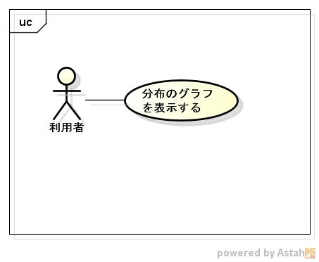

distgraph
=========
1. 目的

   各分布のグラフをjfreechartのライブラリを利用して表示する事ができる  

1. 前提

   サポートOS: rubyが実行できるOS  
   必要ライブラリ:  ruby rake-compilerライブラリ  

1. 機能範囲

   

1. 機能範囲外

1. 制限事項

    必要なライブラリ以外は、表示できない

1. 詳細機能

   * ツールの種類
     - [逆正弦分布](arcsingraph.md)
     - [ベータ分布](betagraph.md)
     - [二項分布](bingraph.md)
     - [コーシー分布](cauchygraph.md)
     - [階２乗分布](chi2graph.md)
     - [定実分布](constrgraph.md)
     - [指数分布](expgraph.md)
     - [F分布グラフ](fgraph.md)
     - [ガンマ分布グラフ](gagraph.md)
     - [幾何分布](gegraph.md)
     - [ガンベル分布](gugraph.md)
     - [超幾何分布](hygegraph.md)
     - [コルモゴロフ=スミルノフ分布](ksgraph.md)
     - [ラプラス分布](lagraph.md)
     - [レヴェ分布](legraph.md)
     - [ロジスティック分布](loggraph.md)
     - [対数正規分布](logngraph.md)
     - [正規分布グラフ](ngraph.md)
     - [仲上分布](nkgraph.md)
     - [パレード分布](pargraph.md)
     - [パスカル分布](pasgraph.md)
     - [ポワソン分布](pograph.md)
     - [トライアングル分布](tglgraph.md)
     - [T分布](tgraph.md)
     - [一様(整数)分布](uniigraph.md)
     - [一様(実数)分布](unirgraph.md)
     - [ワイブル分布](wblgraph.md)
     - [ジーフ分布](zipfgraph.md)
