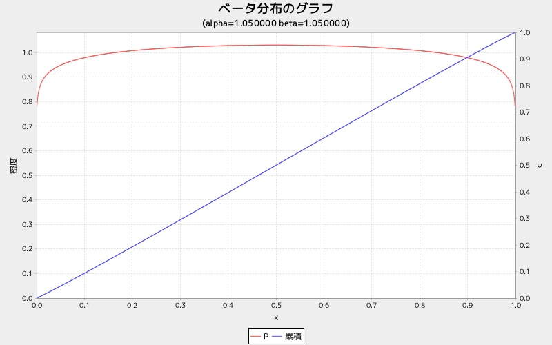

betagraph
=========
ベータ分布グラフを表示する

* 使い方

```ruby
require 'num4distgraph'

Num4DistGraphLib.betagraph(alpha, beta)
```

* 出力サンプル

```ruby
require 'num4distgraph'
Num4DistGraphLib.betagraph(1.05, 1.05)
```



