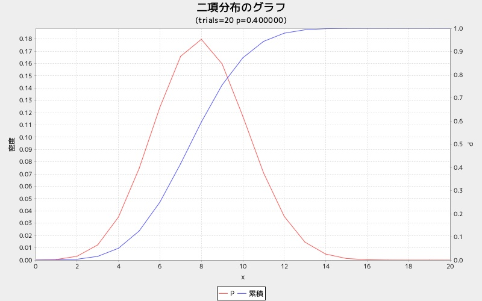

bingraph
========
２項分布グラフを表示する

* 使い方

```ruby
require 'num4distgraph'

Num4DistGraphLib.bingraph(trials, p)
```

* 出力サンプル

```ruby
require 'num4distgraph'
Num4DistGraphLib.bingraph(20, 0.4)
```



