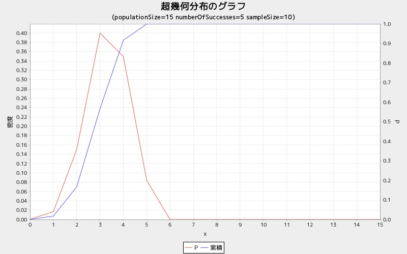
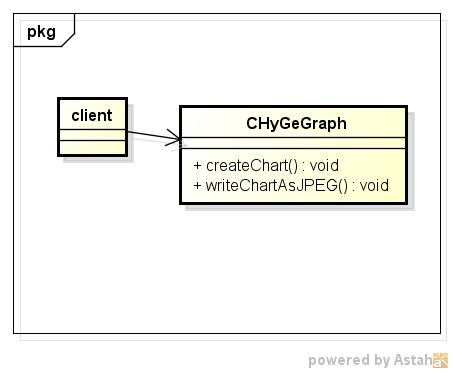
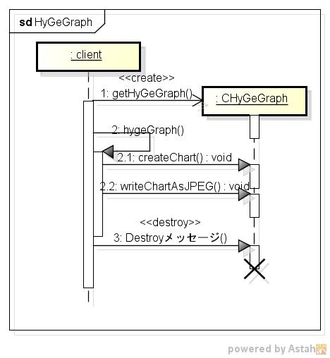

hygegraph
=========
超幾何分布グラフを表示する

* 使い方  
$ hygegraph [JFreeChartModulePath] [populationSize] [numberOfSuccesses] [sampleSize]

* 出力サンプル  

$ ./hygegraph ../lib 	15 5 10  

* クラス図  

* シーケンス図  

