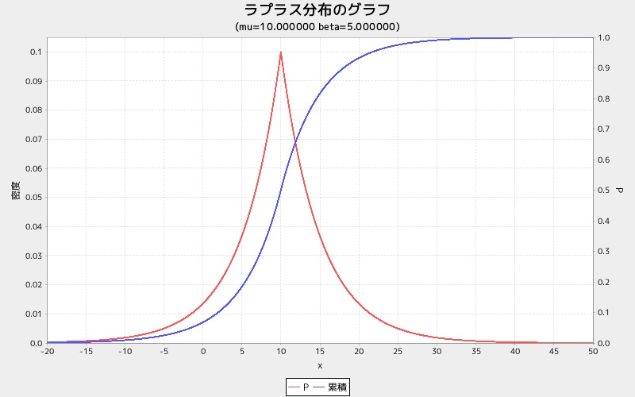

lagraph
=======
ラプラス分布グラフを表示する

## 使い方

```ruby
require 'num4distgraph'
Num4DistGraphLib.lagraph(mu, beta)
```

## 出力サンプル

```ruby
require 'num4distgraph'
Num4DistGraphLib.lagraph(10.0, 5.0)
```



