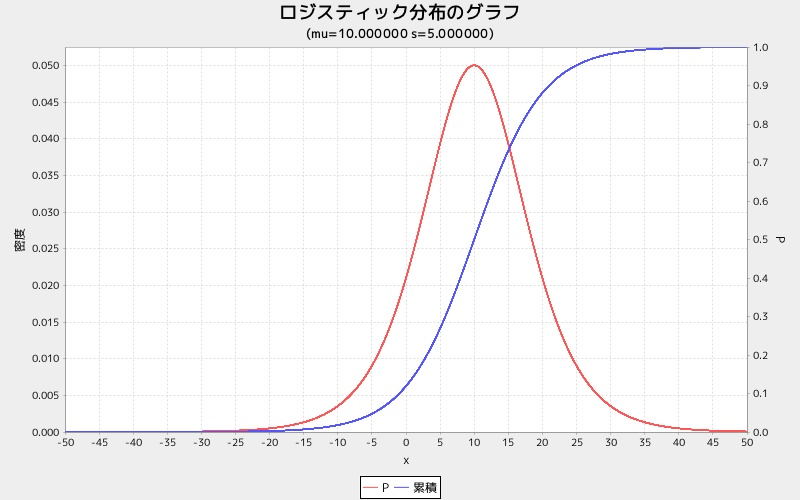

loggraph
========
ロジスティック分布グラフを表示する

* 使い方

```ruby
require 'num4distgraph'
Num4DistGraphLib.loggraph(mu, s)
```

* 出力サンプル

```ruby
require 'num4distgraph'
Num4DistGraphLib.loggraph(10.0, 5.0)
```


