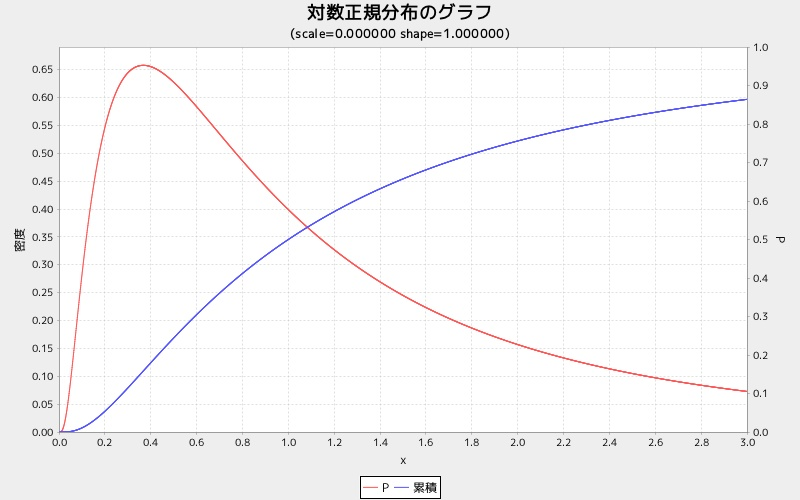

logngraph
=========
対数正規分布グラフを表示する

## 使い方

```ruby
require 'num4distgraph'
Num4DistGraphLib.logngraph(scale, shape)
```

## 出力サンプル

```ruby
require 'num4distgraph'
Num4DistGraphLib.logngraph(10.0, 5.0)
```


