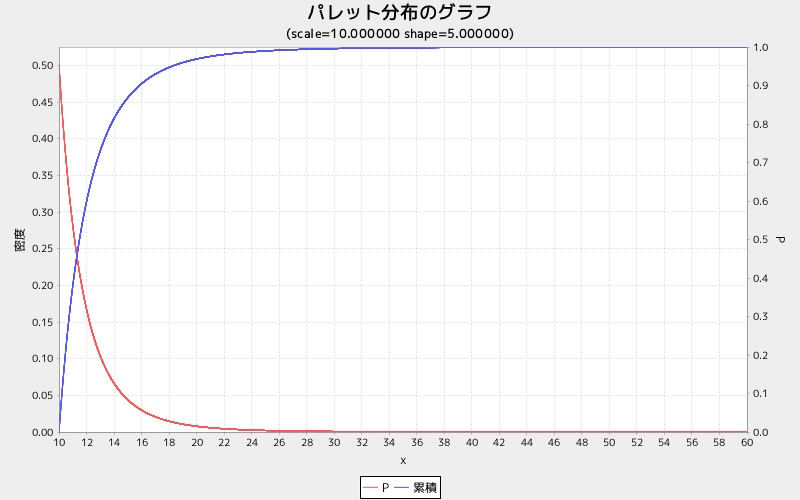

pargraph
========
パレット分布グラフを表示する

* 使い方

```ruby
require 'num4distgraph'
Num4DistGraphLib.pargraph(scale, shape)
```

* 出力サンプル

```ruby
require 'num4distgraph'
Num4DistGraphLib.pargraph(10,  5.0)
```


