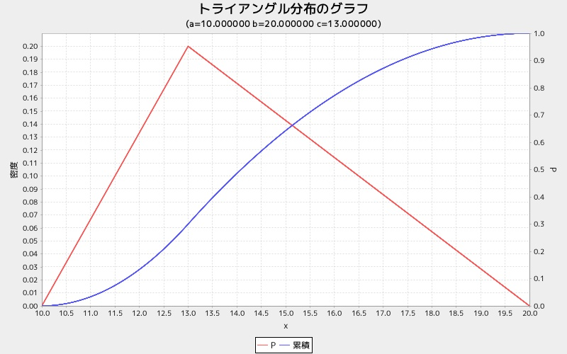

tglgraph
========
トライアングル分布グラフを表示する

## 使い方

```ruby
require 'num4distgraph'
Num4DistGraphLib.tglgraph(a, b, c)
```

## 出力サンプル

```ruby
require 'num4distgraph'
Num4DistGraphLib.tglgraph(10, 20, 13)
```


