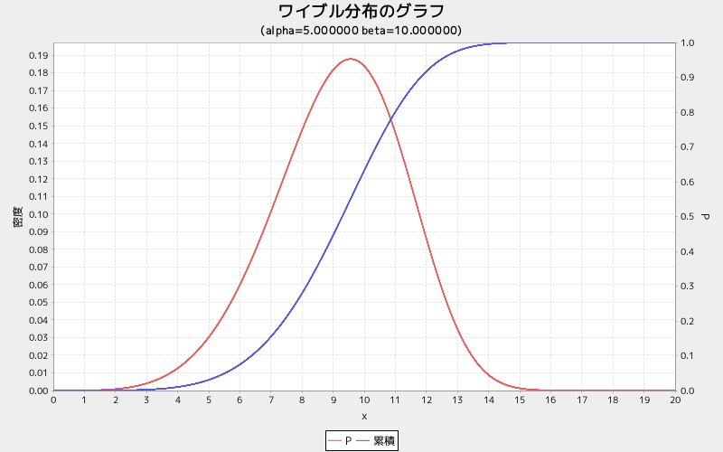

wblgraph
========
ワイブル分布グラフを表示する

## 使い方

```ruby
require 'num4distgraph'
Num4DistGraphLib.wblgraph(alpha, beta)
```

## 出力サンプル

```ruby
require 'num4distgraph'
Num4DistGraphLib.wblgraph(5.0, 10.0)
```

