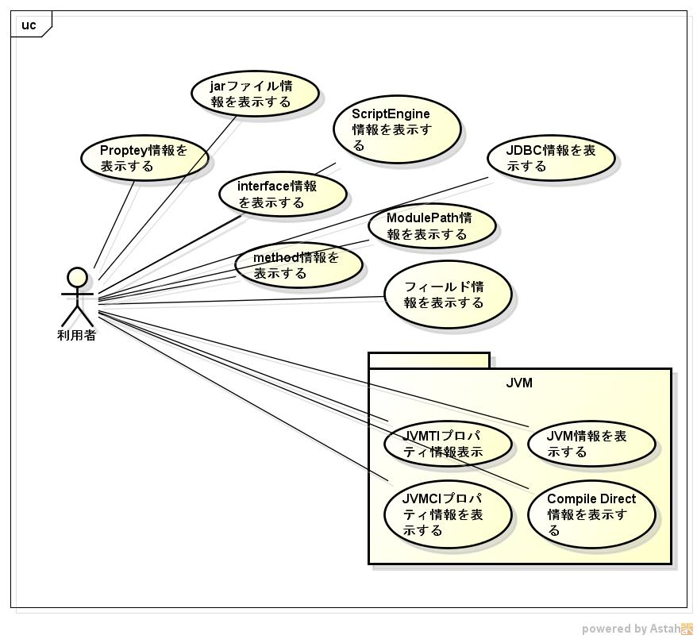

javatool
=======
1. 目的

   c言語からJNIライブラリを使用したツールです。

1. 前提

   サポートOS: linux x86_64  
   サポート言語: java 11以降

1. 機能範囲

   

1. 機能範囲外

1. 制限事項

1. 詳細機能

   * ツールの種類
     - [dspfields](dspfields.md)
     - [dspjarfileinfo](dspjarfileinfo.md)
     - [dspmethods](dspmethods.md)
     - [dsppropinfo](dsppropinfo.md)
     - [dspScriptEngine](dspScriptEngine.md)
     - [dspinterfaces](dspinterfaces.md)
     - [dspmodpthinfo](dspmodpthinfo.md)
     - [dspjdbcinfo](dspjdbcinfo.md)
     - jvm
       - [dspjvmflags](dspjvmflags.md)
       - [dspjvmciprop](dspjvmciprop.md)
       - [dspcmpldirct](dspcmpldirct.md)
       - [dspagentprop](dspagentprop.md)
