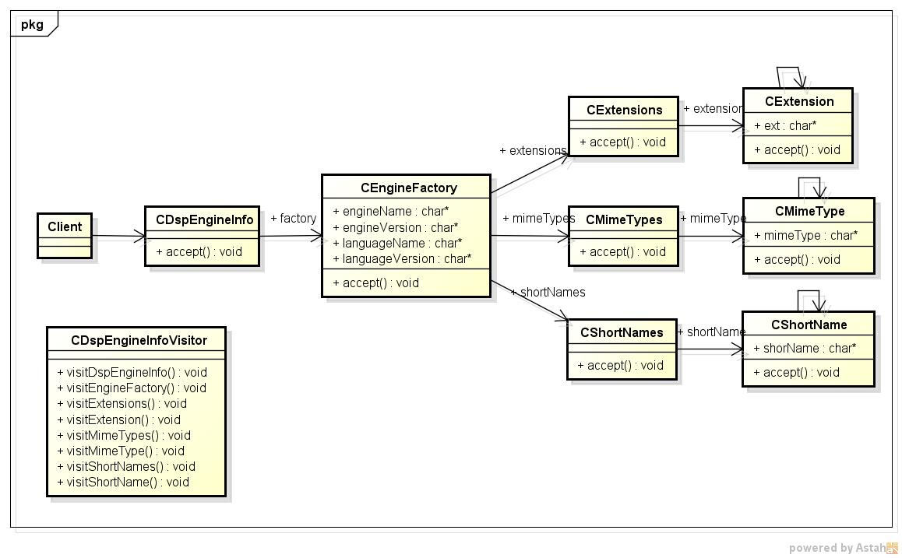
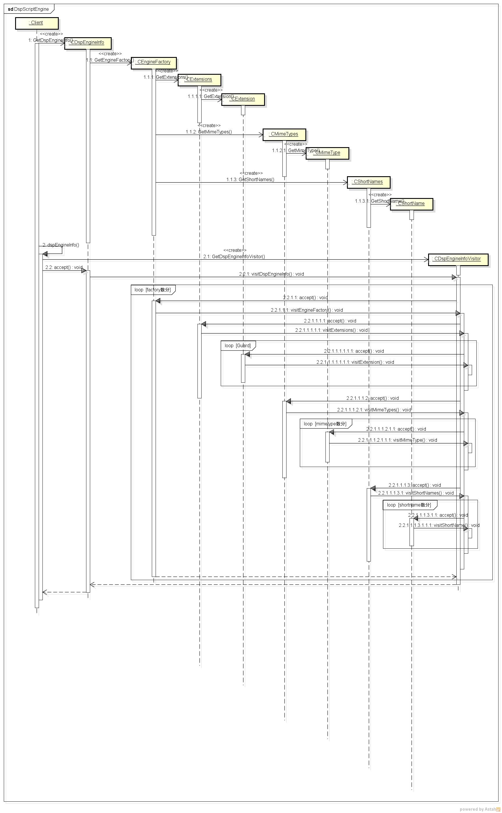

dspScriptEngine
===============
  javaのスクリプトエンジン情報を表示するプログラム

* 表示項目  
  - エンジン名
  - エンジンバージョン
  - 対応言語名
  - 対応言語バージョン
  - 対応拡張子
  - 対応MIME Type
  - 対応ショート名

* 使い方  
  $ dspscrteng

* 出力サンプル  

<pre>
./dspscrteng /opt/jruby/jruby-9.2.11.0/lib
Engine name: JSR 223 JRuby Engine
Engine version: 9.2.11.0
Language name: ruby
Language version: jruby 9.2.11.0
Extension: rb
MimeType: application/x-ruby
Short Name: ruby
Short Name: jruby

Engine name: Oracle Nashorn
Engine version: 11.0.7
Language name: ECMAScript
Language version: ECMA - 262 Edition 5.1
Extension: js
MimeType: application/javascript
MimeType: application/ecmascript
MimeType: text/javascript
MimeType: text/ecmascript
Short Name: nashorn
Short Name: Nashorn
Short Name: js
Short Name: JS
Short Name: JavaScript
Short Name: javascript
Short Name: ECMAScript
Short Name: ecmascript
</pre>
* クラス図  

* シーケンス図

