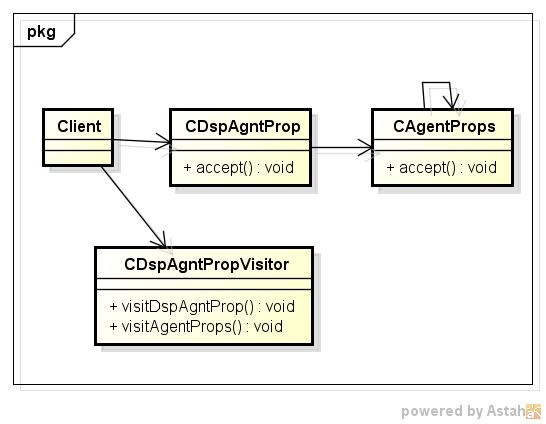
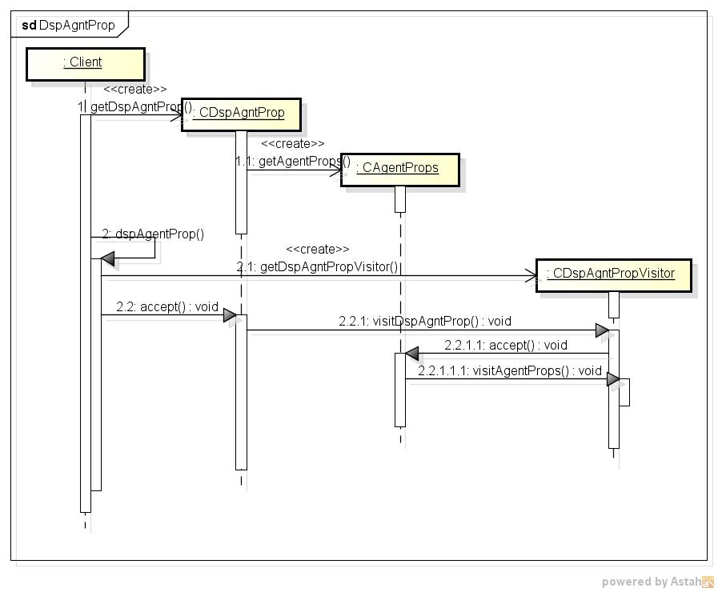

dspagntprop
===========
JVMTIプロパティ情報を表示するプログラム

* 表示項目  
  - key
  - 値

* 使い方  
  $ dspagntprop

* 出力サンプル  

<pre>
$ dspagntprop
sun.java.command: (null)
sun.jvm.flags: (null)
sun.jvm.args: -XX:+UnlockExperimentalVMOptions -XX:+EnableJVMCI
</pre>

* クラス図  

* シーケンス図

