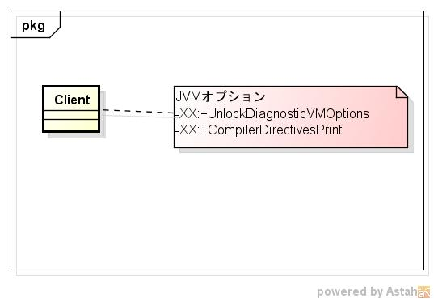
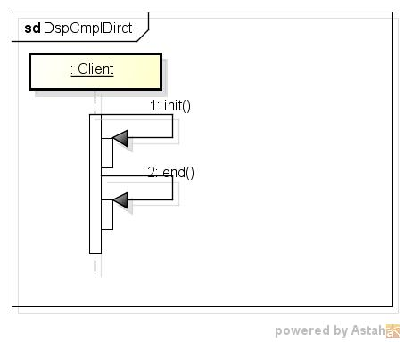

dspcmpldirct
============
compile directive表示

* 表示項目  

* 使い方  
  $ dspcmpldirct

* 出力サンプル  

<pre>
$ dspcmpldirct

Directive: (default)
 matching: *.*
 c1 directives:
  inline: -
  Enable:true Exclude:false BreakAtExecute:false BreakAtCompile:false Log:falsePrintAssembly:false PrintInlining:false PrintNMethods:false BackgroundCompilation:true ReplayInline:false DumpReplay:false DumpInline:false CompilerDirectivesIgnoreCompileCommands:false DisableIntrinsic: BlockLayoutByFrequency:true PrintOptoAssembly:false PrintIntrinsics:false TraceSpilling:false Vectorize:false VectorizeDebug:0 CloneMapDebug:false IGVPrintLevel:0 MaxNodeLimit:80000 ZOptimizeLoadBarriers:true

 c2 directives:
  inline: -
  Enable:true Exclude:false BreakAtExecute:false BreakAtCompile:false Log:falsePrintAssembly:false PrintInlining:false PrintNMethods:false BackgroundCompilation:true ReplayInline:false DumpReplay:false DumpInline:false CompilerDirectivesIgnoreCompileCommands:false DisableIntrinsic: BlockLayoutByFrequency:true PrintOptoAssembly:false PrintIntrinsics:false TraceSpilling:false Vectorize:false VectorizeDebug:0 CloneMapDebug:false IGVPrintLevel:0 MaxNodeLimit:80000 ZOptimizeLoadBarriers:true

</pre>

* クラス図  

* シーケンス図  

