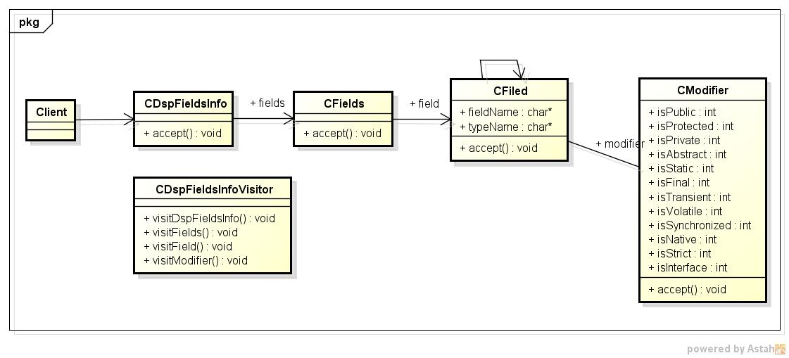
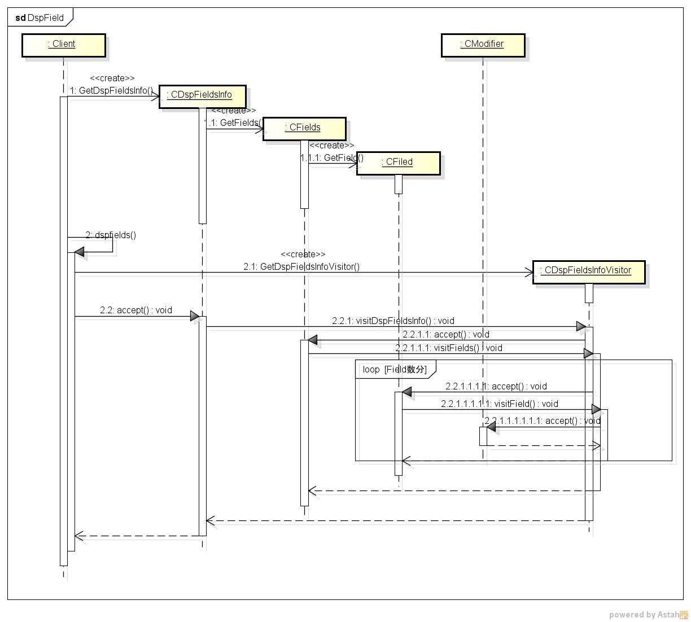

dspfields
=========
javaクラスのフィールド一覧を表示するプログラム 

* 表示項目
 - フィールド名
 - 修飾子
 - フィールドタイプ
 
* 使い方  
$ dspfields フルクラス名

* 出力サンプル  

<pre>
$ dspfields java.lang.Byte  
MIN_VALUE  
      修飾子: public static final  
   fieldType: byte  
  
MAX_VALUE  
      修飾子: public static final  
   fieldType: byte  
  
TYPE  
      修飾子: public static final  
   fieldType: java.lang.Class  
  
SIZE  
      修飾子: public static final  
   fieldType: int  
  
BYTES  
      修飾子: public static final  
   fieldType: int  
</pre>
* クラス図  

* シーケンス図  

