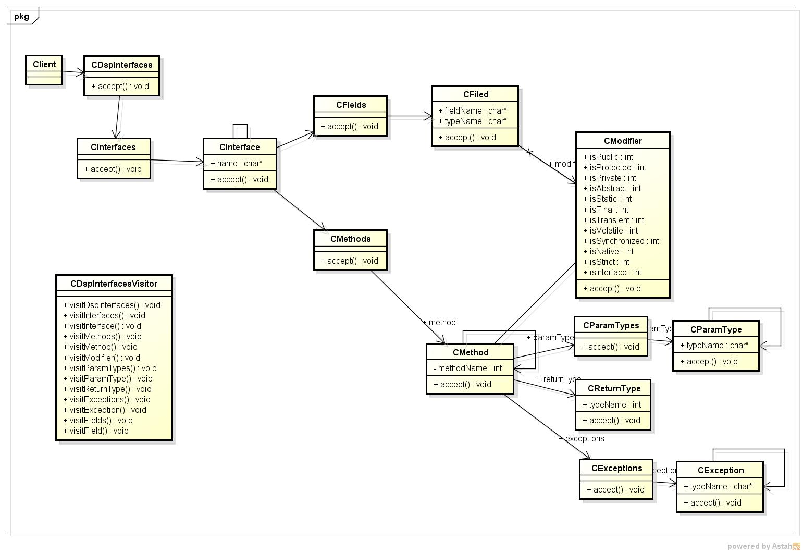
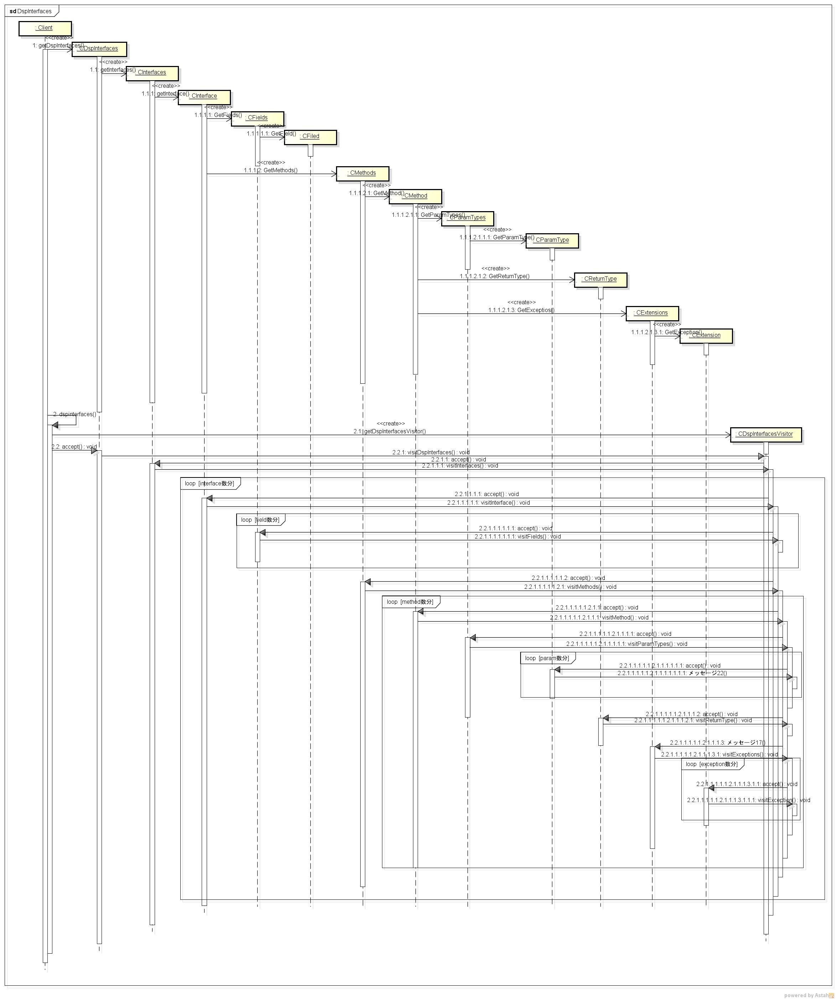

dspinterfaces
=============
javaのInterface情報を表示する

* 表示項目
  - field情報
  - method情報

* 使い方  
$ dspinterfaces フルクラス名

* 出力サンプル  

<pre>
$ dspinterfaces HelloTest
-- interfacesProc --
interface Name: ITest
  a
        修飾子: public static final
     fieldType: int
  b
        修飾子: public static final
     fieldType: int
  c
        修飾子: public static final
     fieldType: int

  dmy
        修飾子: public abstract
     paramType:
    returnType: void
     Exception: java.lang.IllegalAccessException java.lang.InterruptedException
  dmy2
        修飾子: public abstract
     paramType:
    returnType: void
     Exception:

</pre>
* クラス図  

* シーケンス図  

