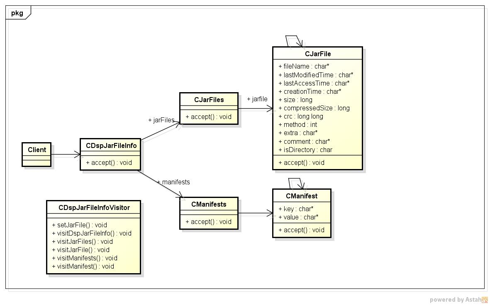
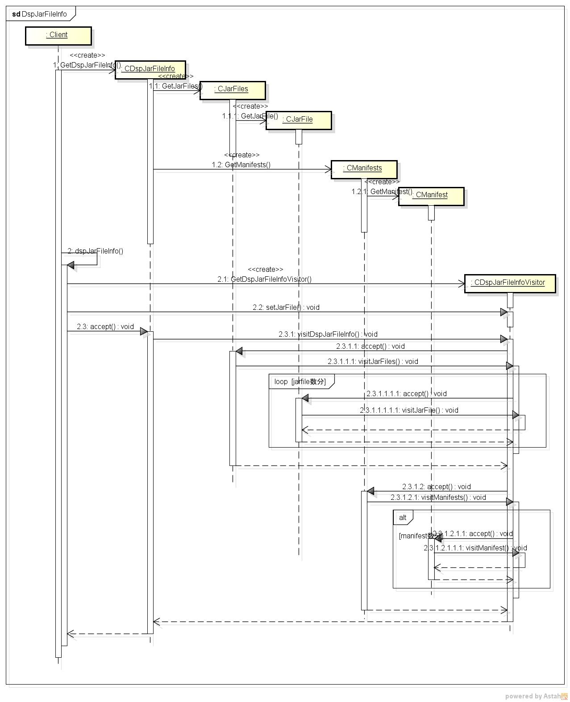

dspjarfileinfo
==============
jarファイルの情報を表示するツールです。

* 表示項目  
  - ファイル名
  - 最終更新日
  - 最終アクセス日
  - 最終作成日
  - サイズ
  -コメント

 
* 使い方  
$ dspjarfileinfo jarファイル名

* 出力サンプル  

<pre>
$ dspjarfileinfo sample.jar
--- jar file entry ---
[D]META-INF/
            最終更新日:2019/07/17 16:50:40
        最終アクセス日:(null)
            最終作成日:(null)
                サイズ:0
              コメント:(null)

[F]META-INF/MANIFEST.MF
            最終更新日:2019/07/17 16:50:42
        最終アクセス日:(null)
            最終作成日:(null)
                サイズ:66
              コメント:(null)

[F]JavaEng.class
            最終更新日:2019/07/16 18:29:24
        最終アクセス日:(null)
            最終作成日:(null)
                サイズ:4317
              コメント:(null)

--- manifest ---
Manifest-Version:1.0
Created-By:11.0.3 (Oracle Corporation)
</pre>
* クラス図  

* シーケンス図

