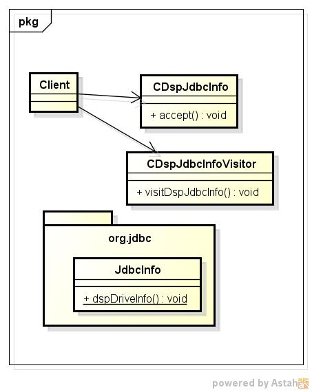
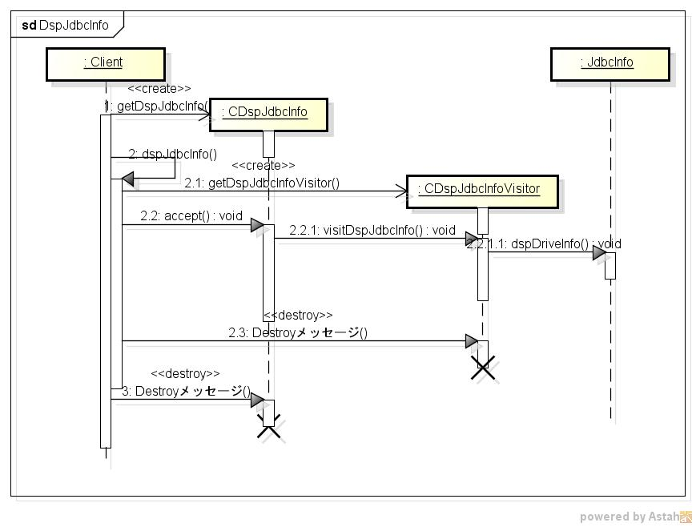

dspjdbcinfo
===========
JDBC情報を表示する

* 表示項目

* 使い方  
$ dspjdbcinfo JDBCDriverPath JDBCUrl

* 出力サンプル  

<pre>
$ ls lib
org.jdbc.jar  postgresql-42.2.9.jar
$ ./dspjdbcinfo lib jdbc:postgresql://localhost:5432/postgres
Major Version:42
Minor Version:2
jdbcCompliant:false
PGDBNAME postgres
	Database name to connect to (may be specified directly in the JDBC URL)
PGHOST localhost
	Hostname of the PostgreSQL server (may be specified directly in the JDBC URL)
PGPORT 5432
	Port of the PostgreSQL server (may be specified directly in the JDBC URL)
user null
	Username to connect to the database as.
password null
	Password to use when authenticating.
protocolVersion null
	Force use of a particular protocol version when connecting, currently only version 3 is supported.
options null
	Specify 'options' connection initialization parameter.
loggerLevel null
	Logger level of the driver
loggerFile null
	File name output of the Logger
prepareThreshold 5
	Statement prepare threshold. A value of {@code -1} stands for forceBinary
preparedStatementCacheQueries 256
	Specifies the maximum number of entries in per-connection cache of prepared statements. A value of {@code 0} disables the cache.
preparedStatementCacheSizeMiB 5
	Specifies the maximum size (in megabytes) of a per-connection prepared statement cache. A value of {@code 0} disables the cache.
databaseMetadataCacheFields 65536
	Specifies the maximum number of fields to be cached per connection. A value of {@code 0} disables the cache.
databaseMetadataCacheFieldsMiB 5
	Specifies the maximum size (in megabytes) of fields to be cached per connection. A value of {@code 0} disables the cache.
defaultRowFetchSize 0
	Positive number of rows that should be fetched from the database when more rows are needed for ResultSet by each fetch iteration
binaryTransfer true
	Use binary format for sending and receiving data if possible
readOnly false
	Puts this connection in read-only mode
binaryTransferEnable 
	Comma separated list of types to enable binary transfer. Either OID numbers or names
binaryTransferDisable 
	Comma separated list of types to disable binary transfer. Either OID numbers or names. Overrides values in the driver default set and values set with binaryTransferEnable.
stringtype null
	The type to bind String parameters as (usually 'varchar', 'unspecified' allows implicit casting to other types)
unknownLength 2147483647
	Specifies the length to return for types of unknown length
logUnclosedConnections false
	When connections that are not explicitly closed are garbage collected, log the stacktrace from the opening of the connection to trace the leak source
logServerErrorDetail true
	Include full server error detail in exception messages. If disabled then only the error itself will be included.
disableColumnSanitiser false
	Enable optimization that disables column name sanitiser
ssl null
	Control use of SSL (any non-null value causes SSL to be required)
sslmode null
	Parameter governing the use of SSL
sslfactory null
	Provide a SSLSocketFactory class when using SSL.
sslfactoryarg null
	Argument forwarded to constructor of SSLSocketFactory class.
sslhostnameverifier null
	A class, implementing javax.net.ssl.HostnameVerifier that can verify the server
sslcert null
	The location of the client's SSL certificate
sslkey null
	The location of the client's PKCS#8 SSL key
sslrootcert null
	The location of the root certificate for authenticating the server.
sslpassword null
	The password for the client's ssl key (ignored if sslpasswordcallback is set)
sslpasswordcallback null
	A class, implementing javax.security.auth.callback.CallbackHandler that can handle PassworCallback for the ssl password.
tcpKeepAlive false
	Enable or disable TCP keep-alive. The default is {@code false}.
loginTimeout 0
	Specify how long to wait for establishment of a database connection.
connectTimeout 10
	The timeout value used for socket connect operations.
socketTimeout 0
	The timeout value used for socket read operations.
cancelSignalTimeout 10
	The timeout that is used for sending cancel command.
socketFactory null
	Specify a socket factory for socket creation
socketFactoryArg null
	Argument forwarded to constructor of SocketFactory class.
receiveBufferSize -1
	Socket read buffer size
sendBufferSize -1
	Socket write buffer size
assumeMinServerVersion null
	Assume the server is at least that version
ApplicationName PostgreSQL JDBC Driver
	Name of the Application (backend >= 9.0)
jaasLogin true
	Login with JAAS before doing GSSAPI authentication
jaasApplicationName null
	Specifies the name of the JAAS system or application login configuration.
kerberosServerName null
	The Kerberos service name to use when authenticating with GSSAPI.
useSpnego false
	Use SPNEGO in SSPI authentication requests
gsslib auto
	Force SSSPI or GSSAPI
sspiServiceClass POSTGRES
	The Windows SSPI service class for SPN
allowEncodingChanges false
	Allow for changes in client_encoding
currentSchema null
	Specify the schema (or several schema separated by commas) to be set in the search-path
targetServerType any
	Specifies what kind of server to connect
loadBalanceHosts false
	If disabled hosts are connected in the given order. If enabled hosts are chosen randomly from the set of suitable candidates
hostRecheckSeconds 10
	Specifies period (seconds) after which the host status is checked again in case it has changed
preferQueryMode extended
	Specifies which mode is used to execute queries to database: simple means ('Q' execute, no parse, no bind, text mode only), extended means always use bind/execute messages, extendedForPrepared means extended for prepared statements only, extendedCacheEverything means use extended protocol and try cache every statement (including Statement.execute(String sql)) in a query cache.
autosave never
	Specifies what the driver should do if a query fails. In autosave=always mode, JDBC driver sets a savepoint before each query, and rolls back to that savepoint in case of failure. In autosave=never mode (default), no savepoint dance is made ever. In autosave=conservative mode, safepoint is set for each query, however the rollback is done only for rare cases like 'cached statement cannot change return type' or 'statement XXX is not valid' so JDBC driver rollsback and retries
cleanupSavepoints false
	Determine whether SAVEPOINTS used in AUTOSAVE will be released per query or not
reWriteBatchedInserts false
	Enable optimization to rewrite and collapse compatible INSERT statements that are batched.
hideUnprivilegedObjects false
	Enable hiding of database objects for which the current user has no privileges granted from the DatabaseMetaData
replication null
	Connection parameter passed in startup message, one of 'true' or 'database' Passing 'true' tells the backend to go into walsender mode, wherein a small set of replication commands can be issued instead of SQL statements. Only the simple query protocol can be used in walsender mode. Passing 'database' as the value instructs walsender to connect to the database specified in the dbname parameter, which will allow the connection to be used for logical replication from that database. (backend >= 9.4)
escapeSyntaxCallMode select
	Specifies how the driver transforms JDBC escape call syntax into underlying SQL, for invoking procedures or functions. (backend >= 11)In escapeSyntaxCallMode=select mode (the default), the driver always uses a SELECT statement (allowing function invocation only).In escapeSyntaxCallMode=callIfNoReturn mode, the driver uses a CALL statement (allowing procedure invocation) if there is no return parameter specified, otherwise the driver uses a SELECT statement.In escapeSyntaxCallMode=call mode, the driver always uses a CALL statement (allowing procedure invocation only).
readOnlyMode transaction
	Controls the behavior when a connection is set to be read only, one of 'ignore', 'transaction', or 'always' When 'ignore', setting readOnly has no effect. When 'transaction' setting readOnly to 'true' will cause transactions to BEGIN READ ONLY if autocommit is 'false'. When 'always' setting readOnly to 'true' will set the session to READ ONLY if autoCommit is 'true' and the transaction to BEGIN READ ONLY if autocommit is 'false'.

</pre>

* クラス図  

* シーケンス図  

