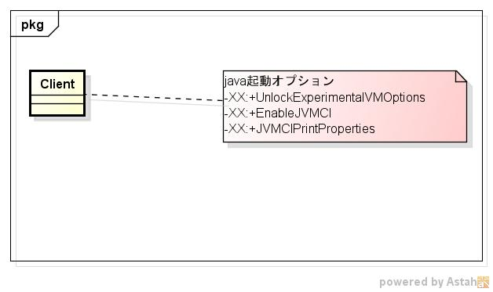
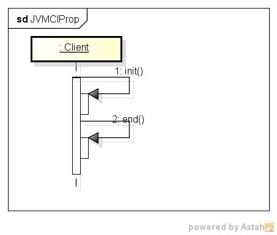

dspjvmciprop
===========
  JVMCIプロパティ情報を表示するプログラム
  
* 表示項目  

* 使い方  
  $ dspjvmciprop

* 出力サンプル  

<pre>
$ dspjvmciprop
[JVMCI properties]
jvmci.Compiler = null                                                     [String]
          Selects the system compiler. This must match the getCompilerName() value returned by a jdk.vm.ci.runtime.JVMCICompilerFactory provider. An empty strin
g or the value "null" selects a compiler that will raise an exception upon receiving a compilation request.
jvmci.InitTimer = false                                                  [Boolean]
          Specifies if initialization timing is enabled.
jvmci.PrintConfig = false                                                [Boolean]
          Prints VM configuration available via JVMCI.
jvmci.TraceMethodDataFilter = null                                        [String]
          Enables tracing of profiling info when read by JVMCI.
          Empty value: trace all methods
          Non-empty value: trace methods whose fully qualified name contains the value.
jvmci.UseProfilingInformation = true                                     [Boolean]

[Graal properties]
graal.AOTInliningDepthToSizeRate = 2.5                                    [Double]
graal.AOTInliningSizeMaximum = 300                                       [Integer]
graal.AOTInliningSizeMinimum = 50                                        [Integer]
graal.ASMInstructionProfiling = null                                      [String]
          Enables instruction profiling on assembler level. Valid values are a
          comma separated list of supported instructions. Compare with subclasses
          of Assembler.InstructionCounter.
graal.AggregatedMetricsFile = null                                        [String]
          File to which aggregated metrics are dumped at shutdown. A CSV format
          is used if the file ends with .csv otherwise a more human readable
          format is used. If not specified, metrics are dumped to the console.
graal.AlwaysInlineIntrinsics = false                                     [Boolean]
          Unconditionally inline intrinsics
graal.AlwaysInlineVTableStubs = false                                    [Boolean]
graal.BenchmarkCountersDumpDynamic = true                                [Boolean]
          Dump dynamic counters
graal.BenchmarkCountersDumpStatic = false                                [Boolean]

....
</pre>

* クラス図  

* シーケンス図

