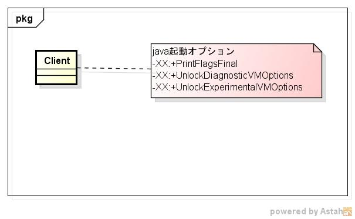
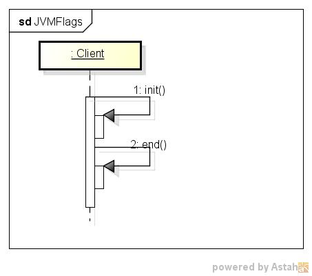

dspjvmflags
===========
  jvmのflag情報を表示するプログラム
* 表示項目  

* 使い方  
  $ dspjvmflags
  
* 出力サンプル  

<pre>
$ dspjvmflags
[Global flags]
ccstrlist AOTLibrary                               =
               {product} {default}
    ccstr AbortVMOnException                       =
            {diagnostic} {default}
    ccstr AbortVMOnExceptionMessage                =
            {diagnostic} {default}
      int ActiveProcessorCount                     = -1
               {product} {default}
    uintx AdaptiveSizeDecrementScaleFactor         = 4
               {product} {default}
    uintx AdaptiveSizeMajorGCDecayTimeScale        = 10
               {product} {default}
    uintx AdaptiveSizePolicyCollectionCostMargin   = 50
               {product} {default}
    uintx AdaptiveSizePolicyInitializingSteps      = 20
               {product} {default}
    uintx AdaptiveSizePolicyOutputInterval         = 0
               {product} {default}
    uintx AdaptiveSizePolicyWeight                 = 10
               {product} {default}
    uintx AdaptiveSizeThroughPutPolicy             = 0
               {product} {default}
    uintx AdaptiveTimeWeight                       = 25
               {product} {default}
     bool AggressiveHeap                           = false
               {product} {default}
     bool AggressiveOpts                           = false
               {product} {default}
     bool AggressiveUnboxing                       = false
       {C2 experimental} {default}
     intx AliasLevel                               = 3
            {C2 product} {default}
     bool AlignVector                              = true
            {C2 product} {default}
    ccstr AllocateHeapAt                           =
               {product} {default}
     intx AllocateInstancePrefetchLines            = 1
               {product} {default}
     intx AllocatePrefetchDistance                 = 256
               {product} {default}
     intx AllocatePrefetchInstr                    = 0
               {product} {default}
...
</pre>
* クラス図  

* シーケンス図

