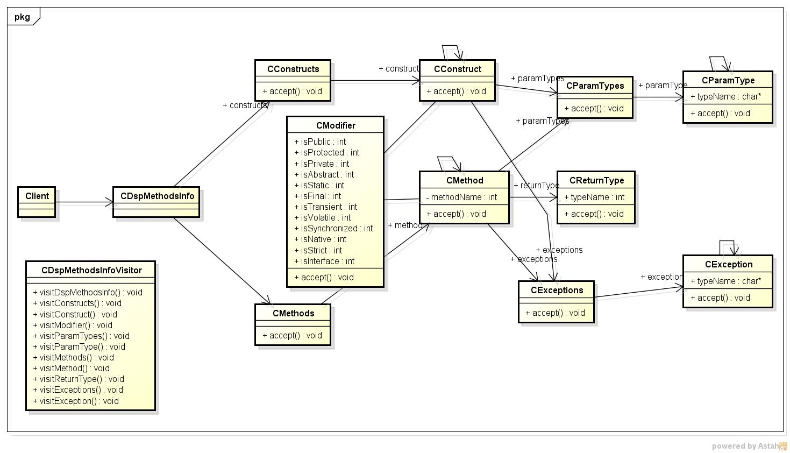
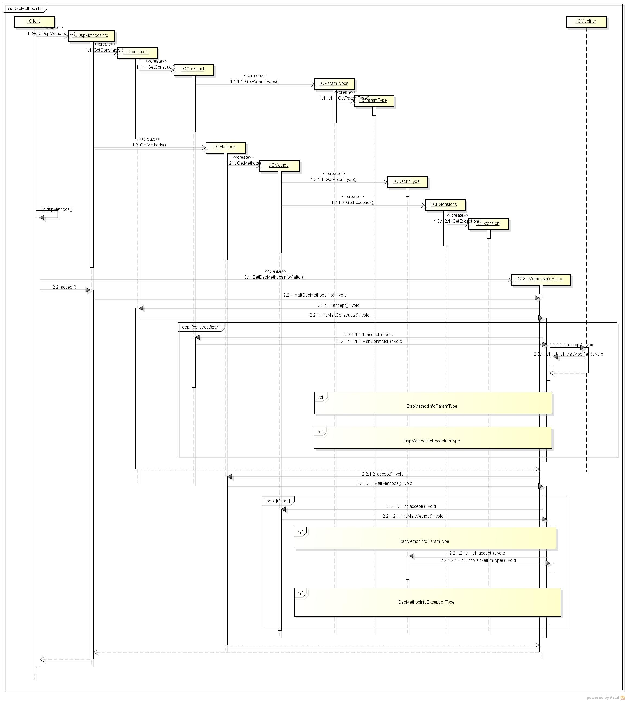
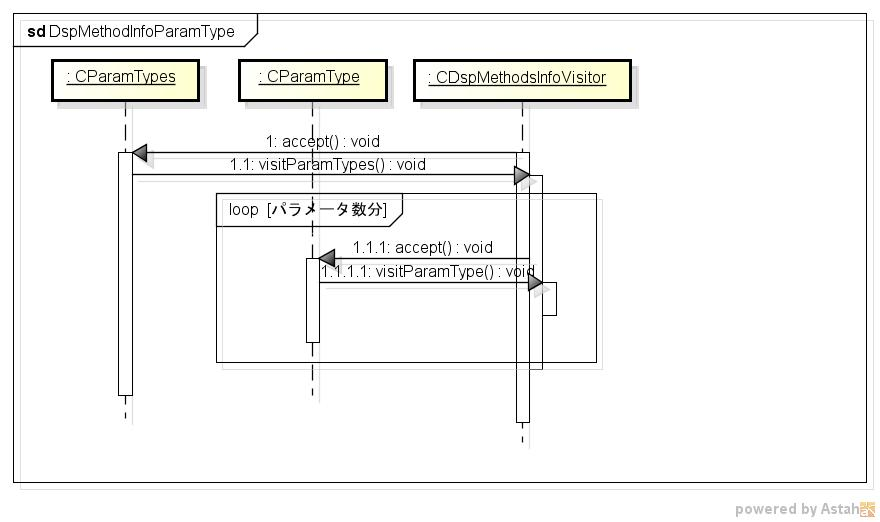
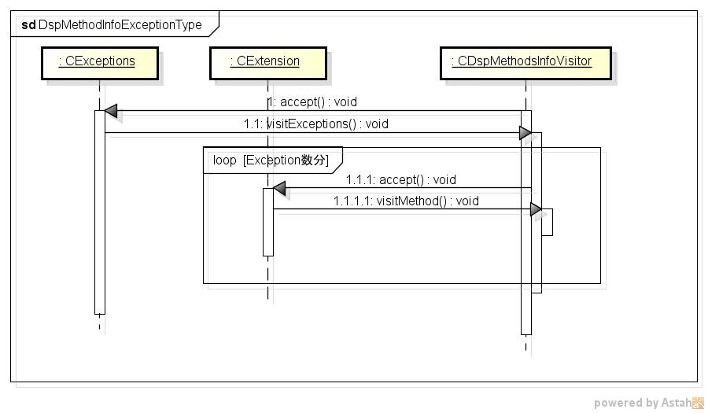

dspmethods
==========
javaクラスの情報を表示するプログラム

* 表示項目  
  - 修飾子
  - パラメータタイプ
  - リターンタイプ
  - Exceptionタイプ
  
* 使い方  
  $ dspmethods フルクラス名

* 出力サンプル  

<pre>
$ dspmethods フルクラス名
-- constructorProc --
      修飾子: public
   paramType: byte
   Exception:

      修飾子: public
   paramType: java.lang.String
   Exception: java.lang.NumberFormatException

-- methodProc --
equals
      修飾子: public
   paramType: java.lang.Object
  returnType: boolean
   Exception:

toString
      修飾子: public
   paramType:
  returnType: java.lang.String
   Exception:

toString
      修飾子: public static
   paramType: byte
  returnType: java.lang.String
   Exception:

hashCode
      修飾子: public static
   paramType: byte
  returnType: int
   Exception:

hashCode
      修飾子: public
   paramType:
  returnType: int
   Exception:

compareTo
      修飾子: public
   paramType: java.lang.Byte
  returnType: int
   Exception:

compareTo
      修飾子: public volatile
   paramType: java.lang.Object
  returnType: int
   Exception:

byteValue
      修飾子: public
   paramType:
  returnType: byte
   Exception:

shortValue
      修飾子: public
   paramType:
  returnType: short
   Exception:

intValue
      修飾子: public
   paramType:
  returnType: int
   Exception:

...
</pre>

* クラス図  

* シーケンス図

