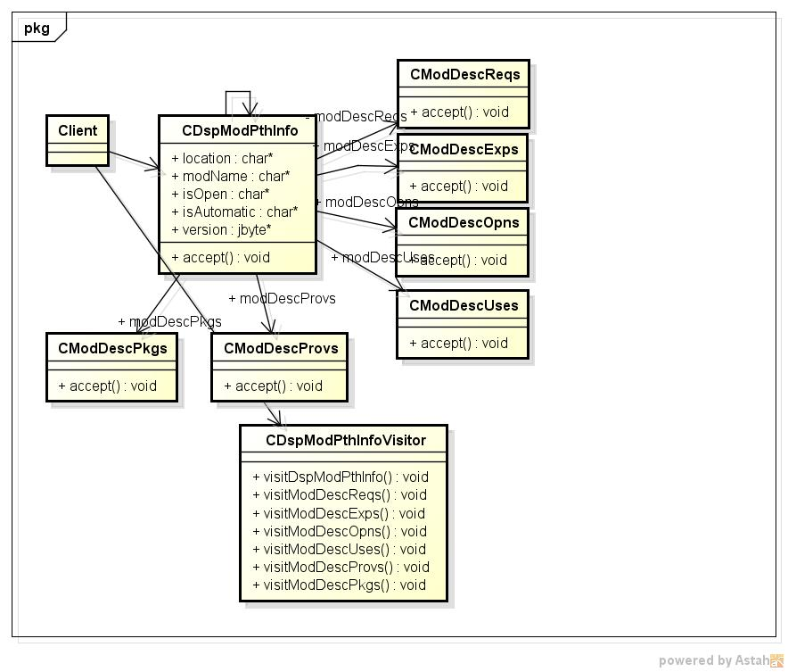
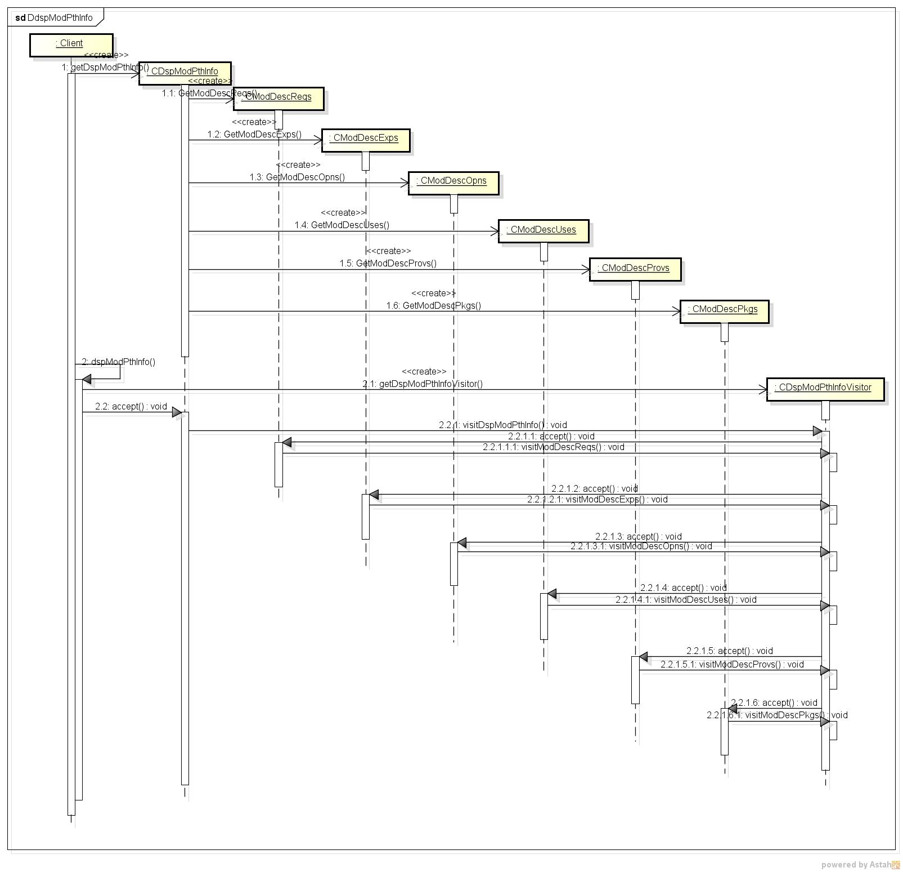

dspmodpthinfo
=============
  module path 情報を表示するプログラム
  
* 表示項目
  - module名
  - location
  - isOpen
  - isAutomatic
  - Version
  - requires
  - exports
  - opens
  - uses
  - providers
  - packages

* 使い方  
  $ dspmodpthinfo modulePath

* 出力サンプル  

<pre>
./dspmodpthinfo ./lib
modName:org.postgresql.jdbc
location:file:///home/sira/javatool/dspmodpthinfo/./lib/postgresql-42.2.9.jar
isOpen:false
isAutomatic:true
version:42.2.9
--- requires ---
java.base Modifier: MANDATED
--- exports ---
--- opens ---
--- uses ---
--- provides ---
java.sql.Driver
--- packages ---
org.postgresql.replication
org.postgresql.replication.fluent.logical
org.postgresql.shaded.com.ongres.scram.common.bouncycastle.pbkdf2
org.postgresql.translation
org.postgresql.shaded.com.ongres.scram.common
org.postgresql.replication.fluent
org.postgresql.ssl.jdbc4
org.postgresql.fastpath
org.postgresql.osgi
org.postgresql.shaded.com.ongres.scram.common.bouncycastle.base64
org.postgresql.shaded.com.ongres.scram.common.message
org.postgresql.largeobject
org.postgresql.ds.common
org.postgresql.core.v3
org.postgresql.core.v3.replication
org.postgresql.shaded.com.ongres.scram.common.util
org.postgresql.shaded.com.ongres.scram.client
org.postgresql.jdbc2.optional
org.postgresql.ssl
org.postgresql.copy
org.postgresql.shaded.com.ongres.saslprep
org.postgresql.shaded.com.ongres.stringprep
org.postgresql
org.postgresql.sspi
org.postgresql.xa
org.postgresql.hostchooser
org.postgresql.replication.fluent.physical
org.postgresql.jdbc
org.postgresql.shaded.com.ongres.scram.common.exception
org.postgresql.gss
org.postgresql.shaded.com.ongres.scram.common.gssapi
org.postgresql.jre7.sasl
org.postgresql.shaded.com.ongres.scram.common.stringprep
org.postgresql.ds
org.postgresql.geometric
org.postgresql.util
org.postgresql.jdbc2
org.postgresql.jdbc3
org.postgresql.core

modName:org.jdbc
location:file:///home/sira/javatool/dspmodpthinfo/./lib/org.jdbc.jar
isOpen:false
isAutomatic:false
version:(null)
--- requires ---
java.base Modifier: MANDATED
java.sql Modifier:
--- exports ---
org.jdbc Modifier:
--- opens ---
--- uses ---
--- provides ---
--- packages ---
org.jdbc

</pre>
* クラス図  

* シーケンス図

