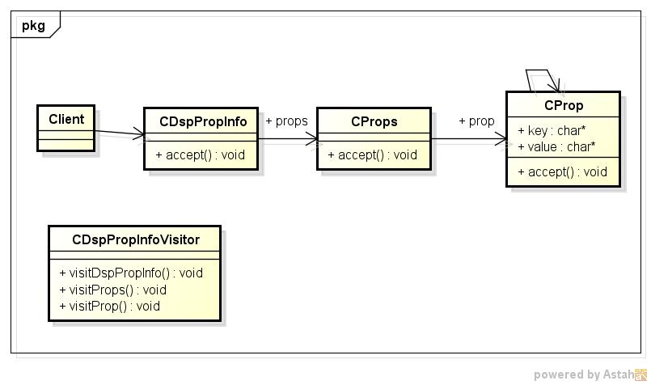
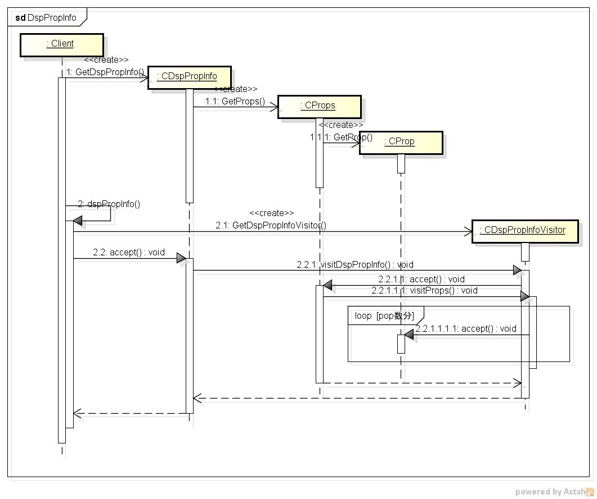

dsppropinfo
===========
javaのシステムプロパティ情報を表示するプログラム

* 表示項目  
  - key
  - 値

* 使い方  
  $ dsppropinfo

* 出力サンプル  

<pre>
$ dsppropinfo
awt.toolkit:
        sun.awt.X11.XToolkit

java.specification.version:
        11

sun.cpu.isalist:

sun.jnu.encoding:
        UTF-8

java.class.path:

java.vm.vendor:
        Oracle Corporation

sun.arch.data.model:
        64
...
</pre>

* クラス図  

* シーケンス図

