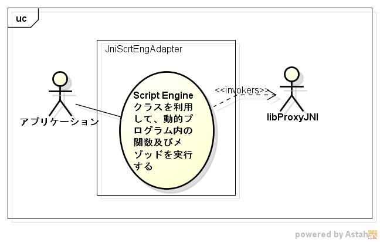
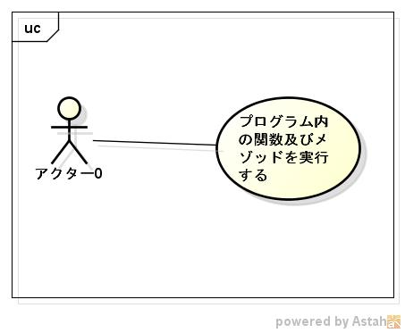

libjniscrteng機能仕様書
=======================
1. 目的

    C言語からScriptEngineクラスを利用して、動的プログラム内の関数及びメゾッドを呼び出す事ができる。

1. 前提

    サポートOS: linux x86_64  
    サポート動的プログラム: graaljs, jruby, jython3

1. 機能範囲

    |version|Use Case                        |
    |-------|--------------------------------|
    |ver 0.9||
    |ver 1.0||

1. 機能範囲外

    サポート動的プログラム以外の動的プログラムは、できない。

1. 制限事項

    |version|                                               |
    |-------|-----------------------------------------------|
    |ver 0.9|libproxyjniに対応していないものは、使用できない|
    |ver 1.0|java 17以前は、使用できない                    |

1. 詳細機能
    1. 動的プログラムファイルの解析
    1. 動的プログラム内の関数を実行
    1. 動的プログラム内のStatic Methodを実行
    1. 動的プログラム内のClassインスタンスを生成
    1. 動的プログラム内のObject Methodを実行
