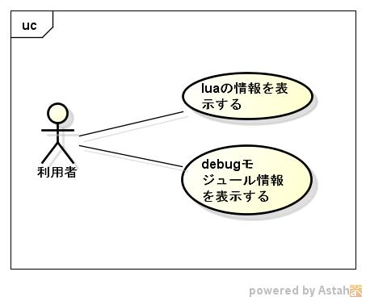

luatool
=======
1. 目的

   c言語からluaのライブラリを呼び出すことができる

1. 前提

   サポートOS: linux 
   サポート言語: lua version 5.1

1. 機能範囲

   

1. 機能範囲外

   サポート言語以外は、できない

1. 制限事項

1. 詳細機能

   * ツールの種類
     - [dspluainfo](dspluainfo,md)
     - [dspdbginfo](dspdbginfo.md)
