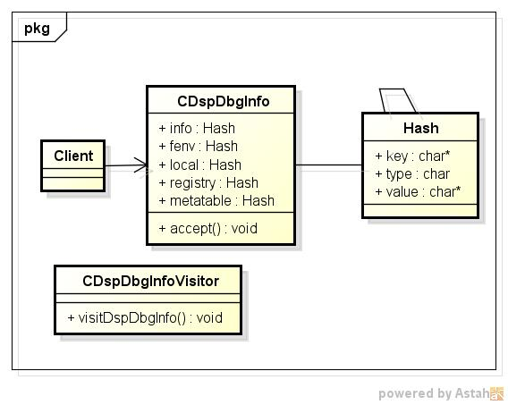
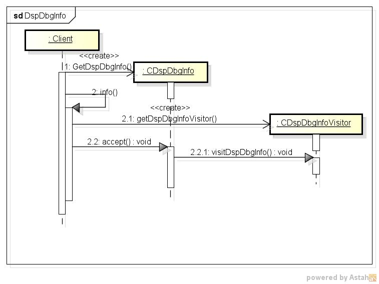

dspdbginfo
==========
debugモジュール情報を表示するプログラムです。

* 表示項目
  - debug.getinfo
  - debug.getfenv
  - debug.getlocal
  - debug.getregistry
  
* 使い方  
$ dspdbginfo

* 出力サンプル  

~~~
$ dspdbginfo
-- debug.getinfo     --  
           nups : <i>0.000000
           what : <s>C
           func : <t>function
lastlinedefined : <i>-1.000000
         source : <s>=[C]
    currentline : <i>-1.000000
       namewhat : <s>
    linedefined : <i>-1.000000
      short_src : <s>[C]
-- debug.getfenv     --
     getupvalue : <t>function
          debug : <t>function
        sethook : <t>function
   getmetatable : <t>function
        gethook : <t>function
   setmetatable : <t>function
       setlocal : <t>function
      traceback : <t>function
        setfenv : <t>function
        getinfo : <t>function
     setupvalue : <t>function
       getlocal : <t>function
    getregistry : <t>function
        getfenv : <t>function
-- debug.getlocal    --
     getupvalue : <t>function
          debug : <t>function
        sethook : <t>function
   getmetatable : <t>function
        gethook : <t>function
   setmetatable : <t>function
       setlocal : <t>function
      traceback : <t>function
        setfenv : <t>function
        getinfo : <t>function
     setupvalue : <t>function
       getlocal : <t>function
    getregistry : <t>function
        getfenv : <t>function
-- debug.getregistry --
         string : <t>table
         xpcall : <t>function
        package : <t>table
       tostring : <t>function
          print : <t>function
             os : <t>table
         unpack : <t>function
        require : <t>function
        getfenv : <t>function
   setmetatable : <t>function
           next : <t>function
         assert : <t>function
       tonumber : <t>function
             io : <t>table
       rawequal : <t>function
 collectgarbage : <t>function
   getmetatable : <t>function
         module : <t>function
         rawset : <t>function
           math : <t>table
          debug : <t>table
          pcall : <t>function
          table : <t>table
       newproxy : <t>function
           type : <t>function
      coroutine : <t>table
             _G : <t>table
         select : <t>function
         gcinfo : <t>function
          pairs : <t>function
         rawget : <t>function
     loadstring : <t>function
         ipairs : <t>function
       _VERSION : <s>Lua 5.1
         dofile : <t>function
        setfenv : <t>function
           load : <t>function
          error : <t>function
       loadfile : <t>function
~~~

* クラス図  

* シーケンス図

