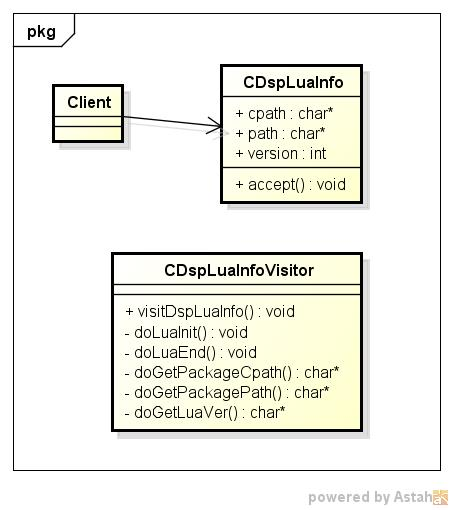
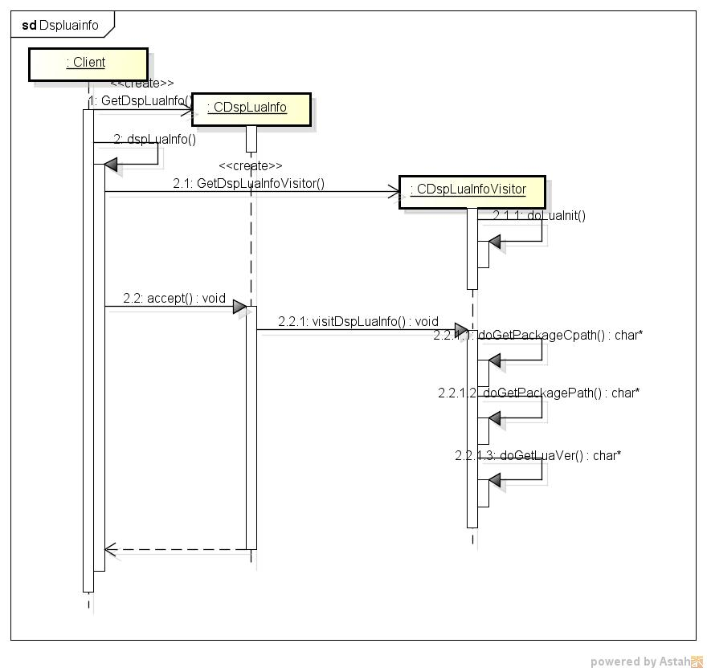

dspluainfo
==========
luaの情報を表示する

* 表示項目
  - version
  - cpath
  - path

* 使い方  
$ dspluainfo

* 出力サンプル  

<pre>
$ dspluainfo
version:Lua 5.1
  cpath:./?.so;/usr/local/lib/lua/5.1/?.so;/usr/local/lib/lua/5.1/loadall.so
   path:./?.lua;/usr/local/share/lua/5.1/?.lua;/usr/local/share/lua/5.1/?/init.lua;
        /usr/local/lib/lua/5.1/?.lua;/usr/local/lib/lua/5.1/?/init.lua
</pre>

* クラス図  

* シーケンス図

