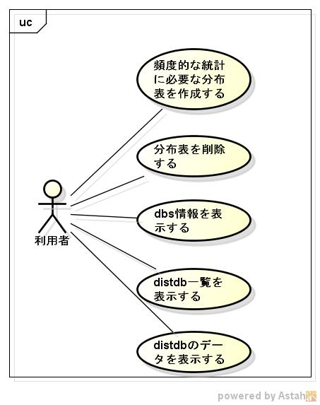

mongodbtoolの機能仕様書
=======================
1. 目的

   頻度論の検定に必要な分布表のデータを、mongoDBに作成する事ができる。

1. 前提

   サポートOS: linux  

1. 機能範囲

      

1. 機能範囲外

1. 制限事項

1. 詳細機能

   * ツールの種類
     - 分布表の作成
       - [標準正規分布表](crtndist.md)
       - [対数正規分布表](crtlogndist.md)  
       - [T分布表](crttdist.md)
       - [F分布表](crtfdist.md)
       - [パレット分布表](crtparetodist.md)
       - [Zipf分布表](crtzipfdist.md)
       - [ベータ2項分布表](crtbebidist.md)
       - [階２乗分布表](crtchi2dist.md)
       - [指数分布表](crtexpdist.md)
       - [２項分布表](crtbidist.md)
       - [Γ分布表](crtgmdist.md)
       - [ガンベル分布表](crtgudist.md)
       - [超幾何分布表](crthgedist.md)
       - [スミルノフ・グラブス分布表](crtgndist.md)
       - [ラプラス分布表](crtladist.md)
       - [レヴェ分布表](crtledist.md)
       - [ロジスティック分布表](crtlogdist.md)
       - [仲上分布表](crtngdist.md)
       - [ポイソン分布表](crtpodist.md)
       - [トライアングル分布表](crttgldist.md)
       - [ワイブル分布表](crtwbldist.md)
       - [コーシー分布表](crtcauchydist.md)
       - [逆正弦分布表](crtasindist.md)
     - [コレクションを削除](dropdist.md)  
     - [dbs情報](dspdbs.md)
     - [distdb](dspdistdbs.md)
     - [コレクション内のデータ](dspdistdts.md)

1. テーブル一覧

   DataBase名:distdb  
  
   |テーブル名称              |コレクション名|
   |--------------------------|--------------|
   |標準正規分布表            |norminv       |
   |対数正規分布表            |lognorminv    |
   |T分布表                   |tinv          |
   |F分布表                   |finv          |
   |パレット分布表            |gpinv         |
   |Zipf分布表                |zipfinv       |
   |ベータ2項分布表           |bebi          |
   |階２乗分布表              |chi2inv       |
   |指数分布表                |expinv        |
   |２項分布表                |biinv         |
   |Γ分布表                  |gminv         |
   |ガンベル分布表            |guinv         |
   |超幾何分布表              |hgeinv        |
   |スミルノフ・グラブス分布表|gninv         |
   |ラプラス分布表            |lainv         |
   |レヴェ分布表              |leinv         |
   |仲上分布表                |nginv         |
   |ポイソン分布表            |poinv         |
   |トライアングル分布表      |tglinv        |
   |ワイブル分布表            |wblinv        |
   |コーシー分布表            |cauchyinv     |
   |逆正弦分布表              |asininv       |
