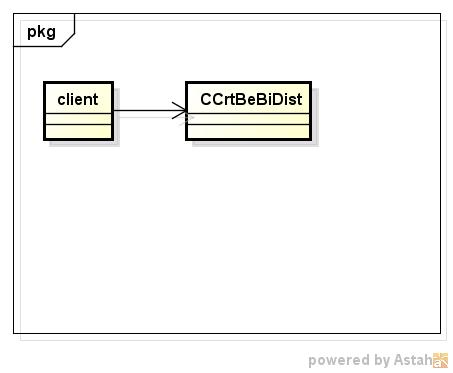
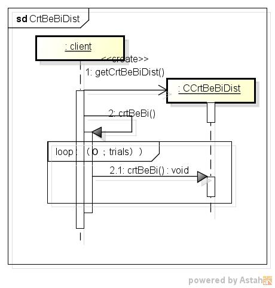

crtbebidist
==========
ベータ2項分布表の作成する

* 使い方  
  $ crtbebidist CommonsMath3ModulePath trials alpha beta | mongoDBurl

* テーブルの型  
  DataBase名:distdb  
  コレクション名:bebi  

  |カラム名|型     |
  |--------|-------|
  |_id     |ID     |
  |n       |int32  |
  |a       |double |
  |b       |double |
  |x       |int32  |
  |p       |double |

* クラス図  

* シーケンス図  

