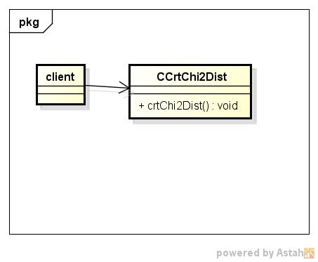
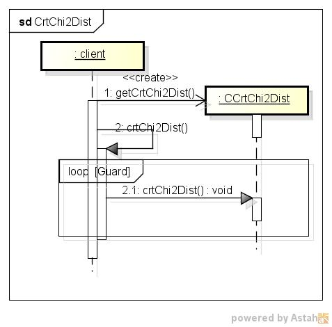

crtchi2dist
===========
階２乗分布表の作成する

* 使い方  
  $ crtchi2dist CommonsMath3ModulePath degreesOfFreedom | mongoDBurl  
  有意水準:0.995、0.990、0.950、0.050、0.025、0.010、0.005  

* テーブルの型  
  DataBase名:distdb  
  コレクション名:chi2inv  

  |カラム名|型     |
  |--------|-------|
  |_id     |ID     |
  |df      |double |
  |p       |double |
  |chi     |double |
  
* クラス図  

* シーケンス図  

