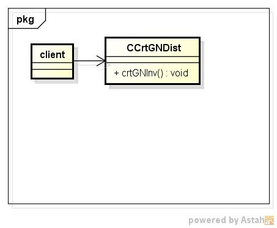
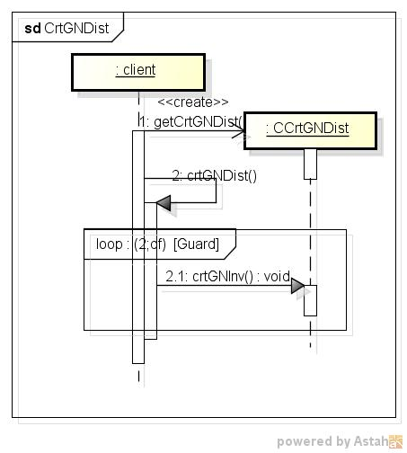

crtgndist
=========
スミルノフ・グラブス分布表の作成する

* 使い方  
  $ crtgndist CommonsMath3ModulePath df | mongoDBurl  
  有意水準:0.050、0.025  

* テーブルの型  
  DataBase名:distdb  
  コレクション名:gninv  

  |カラム名|型     |
  |--------|-------|
  |_id     |ID     |
  |df      |double |
  |p       |double |
  |gn      |double |
  
* クラス図  

* シーケンス図  

