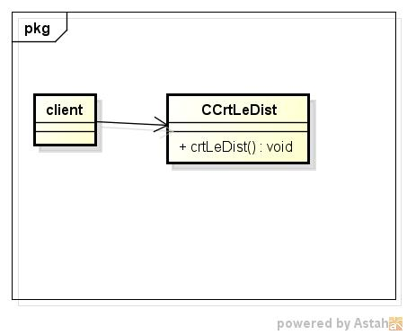
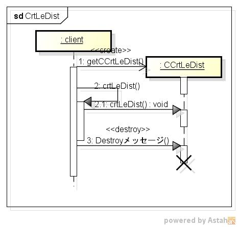

crtledist
=========
レヴェ分布表の作成する

* 使い方  
  $ crtledist CommonsMath3ModulePath mu c | mongoDBurl  
  有意水準:0.050  

* テーブルの型  
  DataBase名:distdb  
  コレクション名:leinv  

  |カラム名|型     |
  |--------|-------|
  |_id     |ID     |
  |mu      |double |
  |c       |double |
  |p       |double |
  |le      |double |
  
* クラス図  

* シーケンス図  

