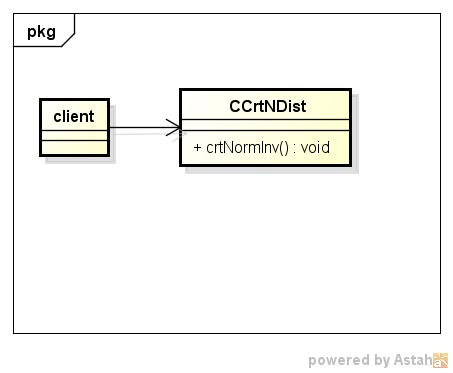
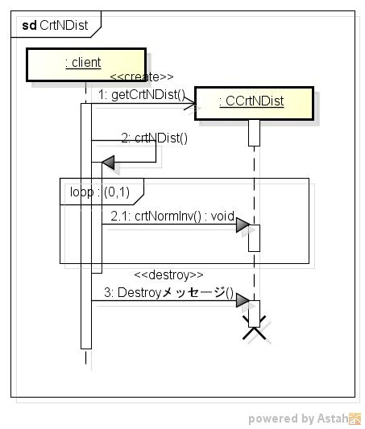

crtndist
========
逆標準正規分布表の作成する

* 使い方  
  $ crtndist CommonsMath3ModulePath | mongoDBurl

* テーブルの型  
  DataBase名:distdb  
  コレクション名:norminv  

  |カラム名|型     |
  |--------|-------|
  |_id     |ID     |
  |p       |double |
  |z       |double |
  
* クラス図  

* シーケンス図  

