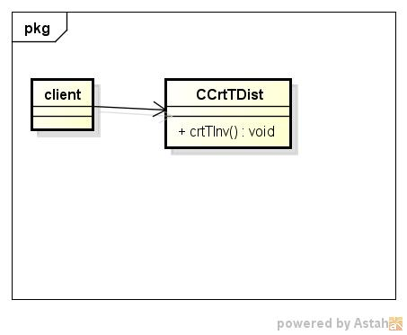
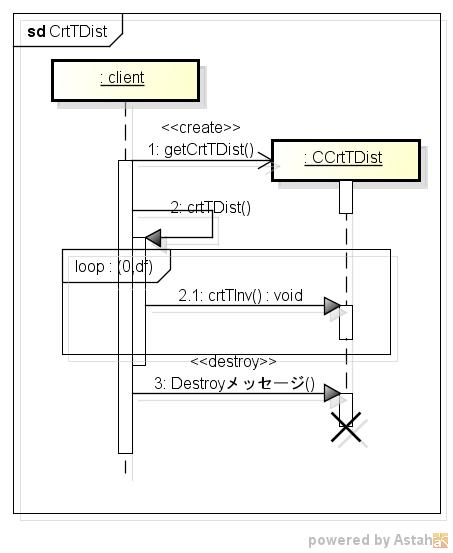

crttdist
========
自由度mの逆t分布表の作成する

* 使い方  
  $ crttdist CommonsMath3ModulePath degreesOfFreedom | mongoDBurl  
  有意水準:0.25、0.1、0.05、0.025、0.01、0.005

* テーブルの型  
  DataBase名:distdb  
  コレクション名:tinv  

  |カラム名|型     |
  |--------|-------|
  |_id     |ID     |
  |df      |double |
  |p       |double |
  |t       |double |
  
* クラス図  

* シーケンス図  

