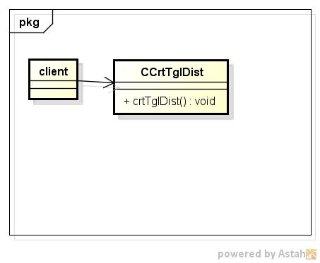
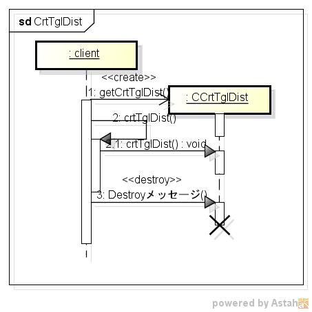

crttgldist
==========
トライアングル分布表の作成する

* 使い方  
  $ crttgldist CommonsMath3ModulePath a b c | mongoDBurl  
  有意水準:0.050  

* テーブルの型  
  DataBase名:distdb  
  コレクション名:tglinv  

  |カラム名|型     |
  |--------|-------|
  |_id     |ID     |
  |a       |double |
  |b       |double |
  |c       |double |
  |p       |double |
  |tgl     |double |
  
* クラス図  

* シーケンス図  

