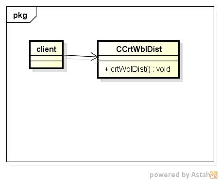
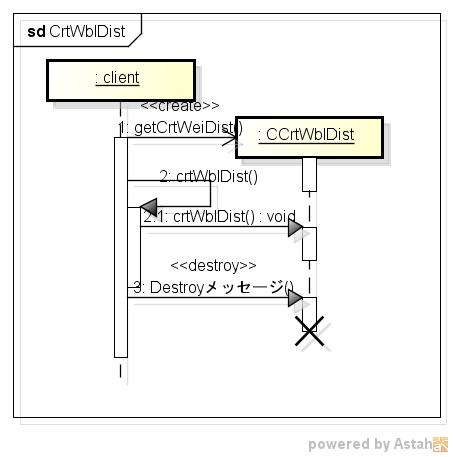

crtwbldist
=========
ワイブル分布表の作成する

* 使い方  
  $ crtwbldist CommonsMath3ModulePath alpha beta | mongoDBurl  
  有意水準:0.050  

* テーブルの型  
  DataBase名:distdb  
  コレクション名:wblinv  

  |カラム名|型     |
  |--------|-------|
  |_id     |ID     |
  |alpha   |double |
  |beta    |double |
  |p       |double |
  |wbl     |double |
  
* クラス図  

* シーケンス図  

