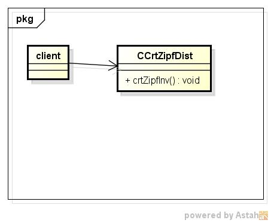
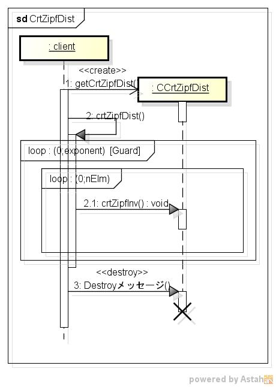

crtzipfdist
===========
Zipf分布表の作成する

* 使い方  
  $ crtzipfdist CommonsMath3ModulePath numberOfElements exponent | mongoDBurl  

* テーブルの型  
  DataBase名:distdb  
  コレクション名:zipfinv  

  |カラム名|型     |
  |--------|-------|
  |_id     |ID     |
  |elm     |int32  |
  |exponent|double |
  |p       |double |
  |zipf    |int32  |
  
* クラス図  

* シーケンス図  

