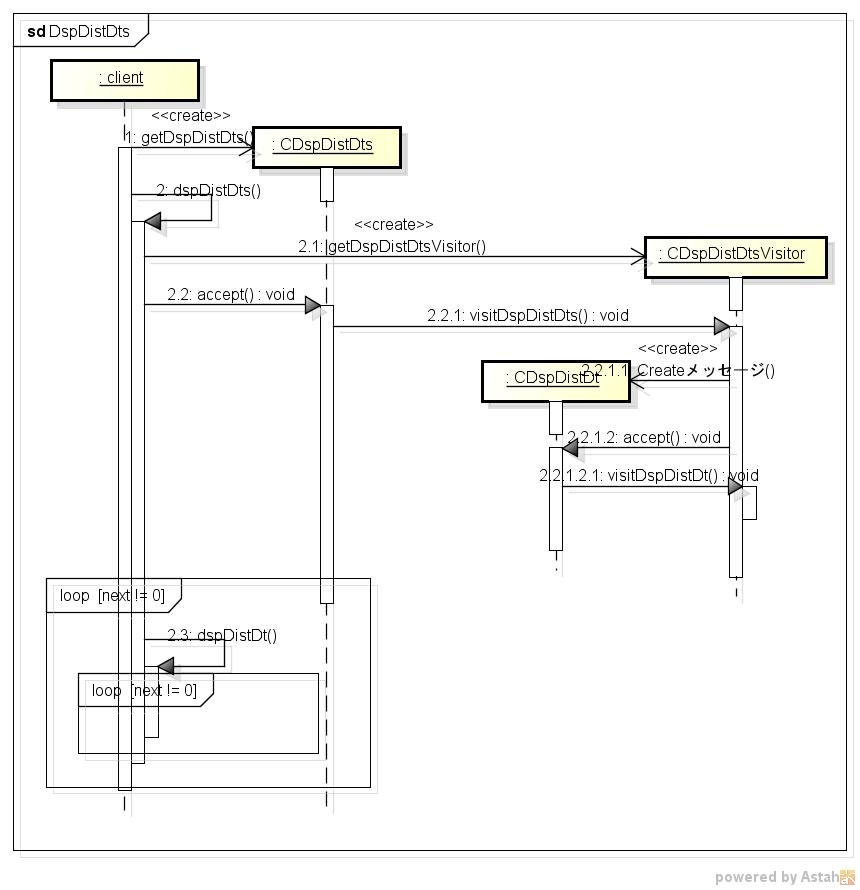

dspdistdts
==========
distdb内のテーブルデータを表示する

* 使い方  
  $ dspdistdts tableName | mongoDBurl  

* 出力サンプル  

<pre>
$ ./dspdistdts bebi
_id: 5fa523952d98486b4f01e3e2 n: 50 a: 0.100000 b: 0.100000 x: 0 p: 0.326557 
_id: 5fa523962d98486b4f01e3e3 n: 50 a: 0.100000 b: 0.100000 x: 1 p: 0.033254 
_id: 5fa523962d98486b4f01e3e4 n: 50 a: 0.100000 b: 0.100000 x: 2 p: 0.018632 
_id: 5fa523962d98486b4f01e3e5 n: 50 a: 0.100000 b: 0.100000 x: 3 p: 0.013292 
_id: 5fa523962d98486b4f01e3e6 n: 50 a: 0.100000 b: 0.100000 x: 4 p: 0.010502 
_id: 5fa523962d98486b4f01e3e7 n: 50 a: 0.100000 b: 0.100000 x: 5 p: 0.008784 
_id: 5fa523962d98486b4f01e3e8 n: 50 a: 0.100000 b: 0.100000 x: 6 p: 0.007618 
_id: 5fa523962d98486b4f01e3e9 n: 50 a: 0.100000 b: 0.100000 x: 7 p: 0.006778 
_id: 5fa523962d98486b4f01e3ea n: 50 a: 0.100000 b: 0.100000 x: 8 p: 0.006144 
_id: 5fa523962d98486b4f01e3eb n: 50 a: 0.100000 b: 0.100000 x: 9 p: 0.005650 
_id: 5fa523962d98486b4f01e3ec n: 50 a: 0.100000 b: 0.100000 x: 10 p: 0.005257 
_id: 5fa523962d98486b4f01e3ed n: 50 a: 0.100000 b: 0.100000 x: 11 p: 0.004938 
_id: 5fa523962d98486b4f01e3ee n: 50 a: 0.100000 b: 0.100000 x: 12 p: 0.004676 
_id: 5fa523962d98486b4f01e3ef n: 50 a: 0.100000 b: 0.100000 x: 13 p: 0.004458 
_id: 5fa523962d98486b4f01e3f0 n: 50 a: 0.100000 b: 0.100000 x: 14 p: 0.004275 
_id: 5fa523962d98486b4f01e3f1 n: 50 a: 0.100000 b: 0.100000 x: 15 p: 0.004122 
_id: 5fa523962d98486b4f01e3f2 n: 50 a: 0.100000 b: 0.100000 x: 16 p: 0.003992 
_id: 5fa523962d98486b4f01e3f3 n: 50 a: 0.100000 b: 0.100000 x: 17 p: 0.003884 
_id: 5fa523962d98486b4f01e3f4 n: 50 a: 0.100000 b: 0.100000 x: 18 p: 0.003793 
_id: 5fa523962d98486b4f01e3f5 n: 50 a: 0.100000 b: 0.100000 x: 19 p: 0.003718 
_id: 5fa523962d98486b4f01e3f6 n: 50 a: 0.100000 b: 0.100000 x: 20 p: 0.003657 
_id: 5fa523962d98486b4f01e3f7 n: 50 a: 0.100000 b: 0.100000 x: 21 p: 0.003608 
_id: 5fa523962d98486b4f01e3f8 n: 50 a: 0.100000 b: 0.100000 x: 22 p: 0.003572 
_id: 5fa523962d98486b4f01e3f9 n: 50 a: 0.100000 b: 0.100000 x: 23 p: 0.003546 
_id: 5fa523962d98486b4f01e3fa n: 50 a: 0.100000 b: 0.100000 x: 24 p: 0.003531 
_id: 5fa523962d98486b4f01e3fb n: 50 a: 0.100000 b: 0.100000 x: 25 p: 0.003525 
_id: 5fa523962d98486b4f01e3fc n: 50 a: 0.100000 b: 0.100000 x: 26 p: 0.003531 
_id: 5fa523962d98486b4f01e3fd n: 50 a: 0.100000 b: 0.100000 x: 27 p: 0.003546 
_id: 5fa523962d98486b4f01e3fe n: 50 a: 0.100000 b: 0.100000 x: 28 p: 0.003572 
_id: 5fa523962d98486b4f01e3ff n: 50 a: 0.100000 b: 0.100000 x: 29 p: 0.003608 
_id: 5fa523962d98486b4f01e400 n: 50 a: 0.100000 b: 0.100000 x: 30 p: 0.003657 
_id: 5fa523962d98486b4f01e401 n: 50 a: 0.100000 b: 0.100000 x: 31 p: 0.003718 
_id: 5fa523962d98486b4f01e402 n: 50 a: 0.100000 b: 0.100000 x: 32 p: 0.003793 
_id: 5fa523962d98486b4f01e403 n: 50 a: 0.100000 b: 0.100000 x: 33 p: 0.003884 
_id: 5fa523962d98486b4f01e404 n: 50 a: 0.100000 b: 0.100000 x: 34 p: 0.003992 
_id: 5fa523962d98486b4f01e405 n: 50 a: 0.100000 b: 0.100000 x: 35 p: 0.004122 
_id: 5fa523962d98486b4f01e406 n: 50 a: 0.100000 b: 0.100000 x: 36 p: 0.004275 
_id: 5fa523962d98486b4f01e407 n: 50 a: 0.100000 b: 0.100000 x: 37 p: 0.004458 
_id: 5fa523962d98486b4f01e408 n: 50 a: 0.100000 b: 0.100000 x: 38 p: 0.004676 
_id: 5fa523962d98486b4f01e409 n: 50 a: 0.100000 b: 0.100000 x: 39 p: 0.004938 
_id: 5fa523962d98486b4f01e40a n: 50 a: 0.100000 b: 0.100000 x: 40 p: 0.005257 
_id: 5fa523962d98486b4f01e40b n: 50 a: 0.100000 b: 0.100000 x: 41 p: 0.005650 
_id: 5fa523962d98486b4f01e40c n: 50 a: 0.100000 b: 0.100000 x: 42 p: 0.006144 
_id: 5fa523962d98486b4f01e40d n: 50 a: 0.100000 b: 0.100000 x: 43 p: 0.006778 
_id: 5fa523962d98486b4f01e40e n: 50 a: 0.100000 b: 0.100000 x: 44 p: 0.007618 
_id: 5fa523962d98486b4f01e40f n: 50 a: 0.100000 b: 0.100000 x: 45 p: 0.008784 
_id: 5fa523962d98486b4f01e410 n: 50 a: 0.100000 b: 0.100000 x: 46 p: 0.010502 
_id: 5fa523962d98486b4f01e411 n: 50 a: 0.100000 b: 0.100000 x: 47 p: 0.013292 
_id: 5fa523962d98486b4f01e412 n: 50 a: 0.100000 b: 0.100000 x: 48 p: 0.018632 
_id: 5fa523962d98486b4f01e413 n: 50 a: 0.100000 b: 0.100000 x: 49 p: 0.033254 
_id: 5fa523962d98486b4f01e414 n: 50 a: 0.100000 b: 0.100000 x: 50 p: 0.326557 
</pre>

* クラス図  

* シーケンス図  

