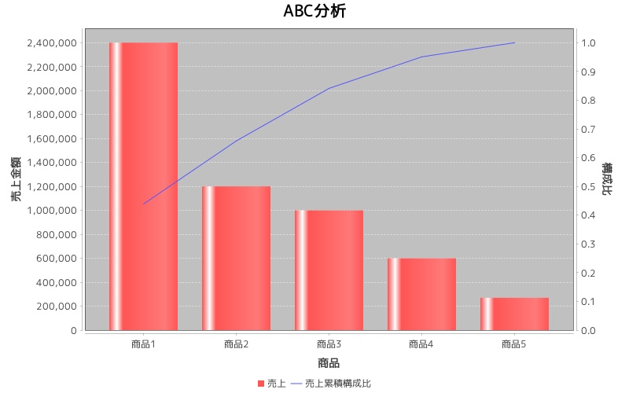

abcana
======
ABC分析(パレード分析)

## 概要
### ABC分析(パレード分析)

パレードの法則に基づいた分析フレームワークで、売上高・コスト・在庫などの指標を大きい順にランク付けし、優先度を決めて管理するためのもの。  
ABC分析は別名「重点分析」とも呼ばれ、重点度の高いものからA、B、Cに分類し管理する。  

### パレードの法則

「売上の8割は全体の2割の商品で生み出している」という考え。イタリアの経済・社会学者V・パレードによって唱えられた法則であり「少数要因によって大勢は左右される」という社会現象を法則として定義したもの。  
その特徴から「80:20の法則」または「ばらつきの法則」とも呼ばれる。

## 使い方

```ruby
sales_info = [
     {"name" => "商品1", "revenue" => 2400000},
     {"name" => "商品2", "revenue" => 1200000},
     {"name" => "商品3", "revenue" => 1000000},
     {"name" => "商品4", "revenue" => 600000},
     {"name" => "商品5", "revenue" => 270000},
]
sale = Num4SaleAnaLib::SalesAnaLib.new
sale.abcana(sales_info)
```

・出力サンプル  



