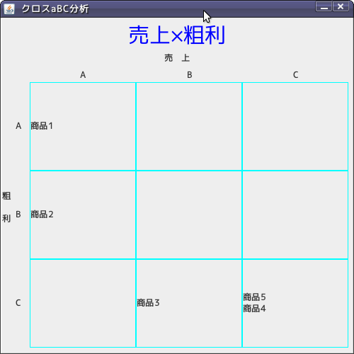

crossabcana
===========
クロスABC分析(売上×粗利)

## 概要

商品を「売上金額と粗利額」といった2つの視点からABCランク付けを行い、より細かく分類する方法。  
クロスABC分析を使えば、単純に累積売上高を比べるだけではわからない、粗利額の高い商品がきちんと売り上げているかなどの詳しい分析が可能です。

## 使い方

```ruby
sales_info = [
 {"name" => "商品1", "stock" => 2380, "sale" => 24000, "quantity" => 100},
 {"name" => "商品2", "stock" => 2380, "sale" => 12000, "quantity" => 100},
 {"name" => "商品3", "stock" => 2380, "sale" => 10000, "quantity" => 100},
 {"name" => "商品4", "stock" => 2380, "sale" => 6000,  "quantity" => 100},
 {"name" => "商品5", "stock" => 2380, "sale" => 2700,  "quantity" => 100},
]
sale = Num4SaleAnaLib::SalesAnaLib.new
sale.crossabcana(sales_info)
```

・出力サンプル


