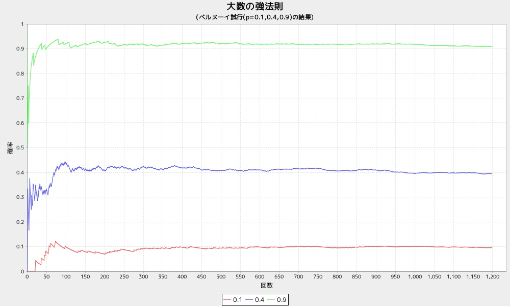

大数の強法則
===========
ベルヌーイ試行による確率をグラフ表示する

# 概要

大数の弱法則より少ない条件でより強い結論を導くもので、
標本数nが十分に大きければ、「独立に同一の分布に従う確率変数」の標本平均と母平均（期待値）とが一致する確率が1に近づく  
(数学的には、標本平均は母平均に概収束すると言います。)  

```math
P \{ \lim_{n\to \infty} \bar{x_n} = \mu \}= 1
```

* 表示項目
  - 0.1
  - 0.4
  - 0.9

## 使い方

```ruby
require 'num4probstdy'
Num4ProbStdyLib.dspbdist(n=1200)
```

## 出力サンプル

```ruby
require 'num4probstdy'
Num4ProbStdyLib.dspbdist()
```



