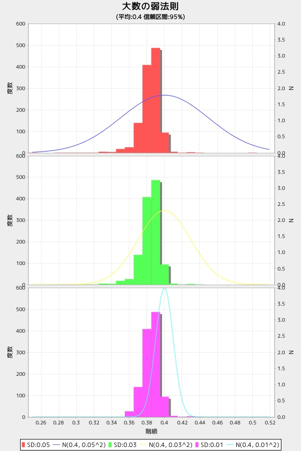

dspbdist2
=========
大数の弱法則

* 表示項目
  - 平均:0.4 標準偏差:0.05
  - 平均:0.4 標準偏差:0.03
  - 平均:0.4 標準偏差:0.01

* 使い方

大数の弱法則

```ruby
require 'num4probstdy'
Num4ProbStdyLib.dspbdist2(n=1200)
```

* 出力サンプル

```ruby
require 'num4probstdy'
Num4ProbStdyLib.dspbdist2(n)
```




