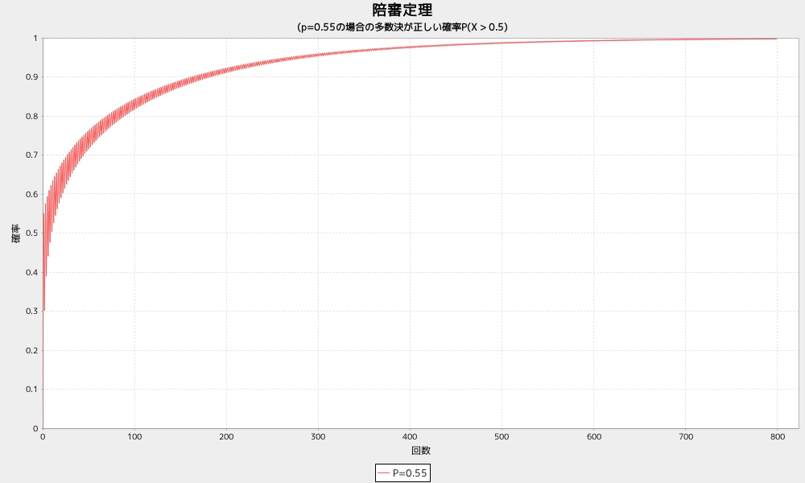

dspbdist3
=========
2高分布で多数が正しい確率

* 使い方

陪審定理

```ruby
require 'num4probstdy'
Num4ProbStdyLib.dspbdist3(p, n=1200)
```

* 出力サンプル

```ruby
require 'num4probstdy'
Num4ProbStdyLib.dspbdist3(0.55)
```



