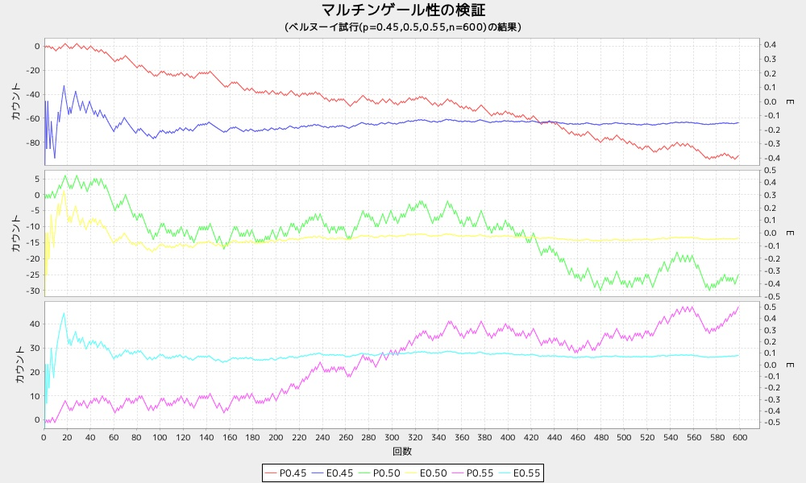

dspbdist5
=========
マルチンゲール性を、グラフ表示する

* 表示項目
  - 0.45
  - 0.50
  - 0.55

* 出力サンプル

マルチンゲール性
```ruby
require 'num4probstdy'
Num4ProbStdyLib.dspbdist5(n=600)
```

* 出力サンプル

```ruby
require 'num4probstdy'
Num4ProbStdyLib.dspbdist5()
```


