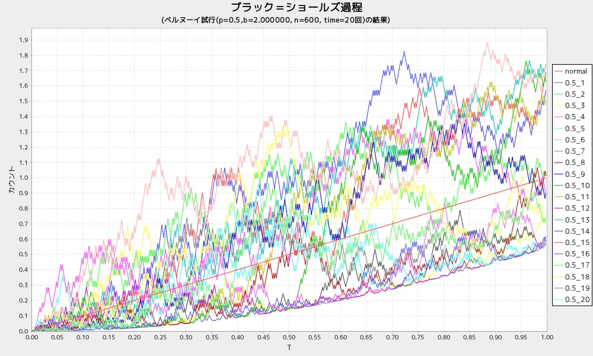

dspbdist7
=========
ブラック＝ショールズ過程について、フラフを表示する

* 表示項目
  - 0.5

## 使い方

```ruby
require 'num4probstdy'
Num4ProbStdyLib.dspbdist7(n=600)
```

## 出力サンプル

```ruby
require 'num4probstdy'
Num4ProbStdyLib.dspbdist7()
```



