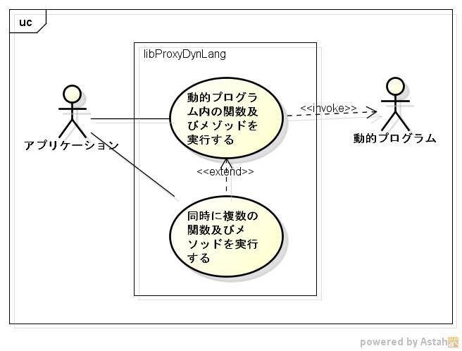

libproxydynlangの機能仕様書
===========================
1. 目的

   C言語から動的プログラム内の関数及びメゾッドを、呼び出すことができる  

1. 前提

    サポートOS: linux  
    サポート動的プログラム: vine linux 6.5に付属している言語  

1. 機能範囲

      

1. 機能範囲外

    vine linuxに付属していない動的プログラムはサポートしない。  

1. 制限事項

1. 詳細機能
    1. 動的プログラムファイルの解析
    1. 動的プログラム内の関数を実行
    1. 動的プログラム内のStatic Methodを実行
    1. 動的プログラム内のClassインスタンスを生成
    1. 動的プログラム内のObject Methodを実行
