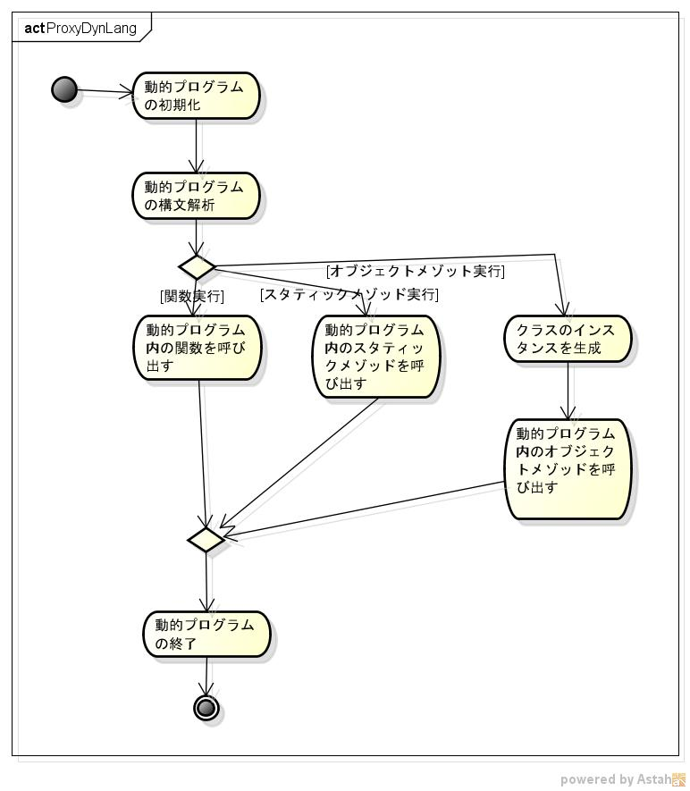
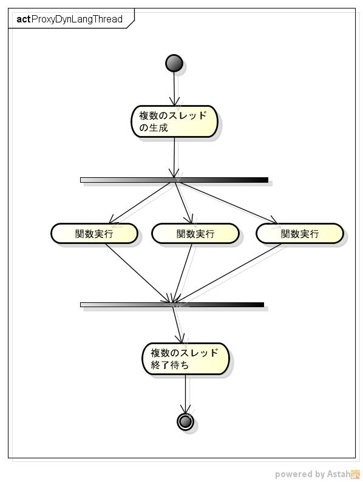

libproxydynlangの機能仕様書
===========================
1. 目的

  

1. 前提

サポートOS: linux  
サポート動的プログラム: vine linux 6.5に付属している言語  

1. 機能範囲

動的プログラムファイルを、解析する事ができる。  
動的プログラム内の関数を、呼び出す事ができる。  
動的プログラム内のスタティック・メゾッドを、呼び出す事ができる。  
動的プログラム内のクラスのインスタンスを、生成することができる。  
動的プログラム内のオブジェクト・メゾッドを、呼び出す事ができる。  

1. 機能範囲外

vine linuxに付属していない動的ぴログラムはサポートしない。  

1. 制限事項

1. 詳細機能

  
  

