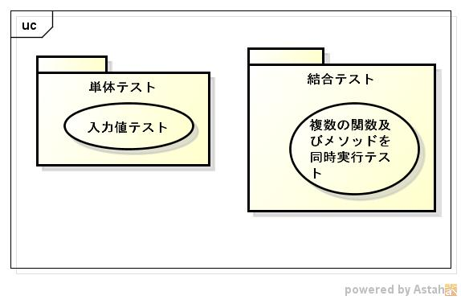
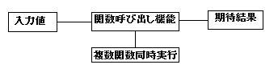

proxydynlangtest
================
libproxydynlangのtestプログラムです。

1. テスト分析
    1. テスト対象分析
    
        FV表  
        
        <table>
        <tr>
            <th>no.</th>
            <th>目的機能(F)</th>
            <th>検証内容(V)</th>
            <th>テスト技法(T)</th>
        </tr>
        <tr>
            <td>6.i</td>
            <td>動的プログラムの初期化する</td>
            <td>動的プログラムの初期化できる事</td>
            <td></td>
        </tr>
        <tr>
            <td>6.ii.a</td>
            <td>動的プログラムの解析する</td>
            <td>動的プログラムの解析できる事</td>
            <td></td>
        </tr>
        <tr>
            <td>6.ii.b</td>
            <td>動的プログラム内の関数を実行する</td>
            <td>パラメータを設定し、関数を実行できる事</td>
            <td></td>
        </tr>
        <tr>
            <td>6.ii.c</td>
            <td>動的プログラム内のStaticMethodを実行する</td>
            <td>パラメータを設定し、StaticMethodを実行できる事</td>
            <td></td>
        </tr>
        <tr>
            <td rowspan="2">6.ii.e</td>
            <td rowspan="2">動的プログラム内のObjectMethodを実行する</td>
            <td>パラメータ無しで、クラスを生成できる事</td>
            <td>　</td>
        </tr>
        <tr>
            <td>パラメータを設定し、ObjectMethodを実行できる事</td>
            <td>　</td>
        </tr>
        <tr>
            <td rowspan="2">6.ii.d</td>
            <td rowspan="2">クラスを生成する</td>
            <td>パラメータ有で、クラスを生成できる事</td>
            <td>　</td>
        </tr>
        <tr>
            <td>パラメータを設定し、ObjectMethodを実行できる事</td>
            <td>　</td>
        </tr>
        <tr>
            <td>6.iii</td>
            <td>動的プログラム内の関数及びメゾッドを複数同時に実行する</td>
            <td>複数の関数を実行できる事</td>
            <td></td>
        </tr>
        </table>
    
        データ型  
        |パラメータ型  |戻り型          |ハッシュ型    |
        |--------------|----------------|--------------|
        |              |戻り値無し      |              |
        |int型         |int型           |int型         |
        |long型        |long型          |long型        |
        |float型       |float型         |float型       |
        |double型      |double型        |double型      |
        |文字列型      |文字列型        |文字列型      |
        |int型の配列   |int型の配列     |int型の配列   |
        |long型の配列  |long型の配列    |long型の配列  |
        |float型の配列 |float型の配列   |float型の配列 |
        |double型の配列|double型の配列  |double型の配列|
        |ハッシュ型    |ハッシュ型      |ハッシュ型    |
        |              |ハッシュ型の配列|              |
        |Object型      |Object型        |Object型      |
    
    1. テスト要求分析
        * 動的ファイルの解析
        * 関数テスト
          * パラメータテスト
          * 戻り値テスト
        * Staticメゾットテスト
          * パラメータテスト
          * 戻り値テスト
        * Objectメゾッドテスト
          * パラメータテスト
          * 戻り値テスト
        * インスタンステスト(パラメータあり)
        * スレッドテスト
    
1. テストアーキテクチャー
    1. テストコンテナ
    
        
    
    1. テストフレーム

        
