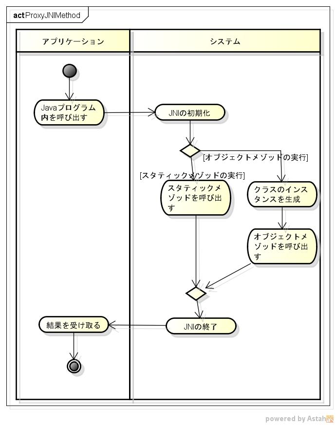
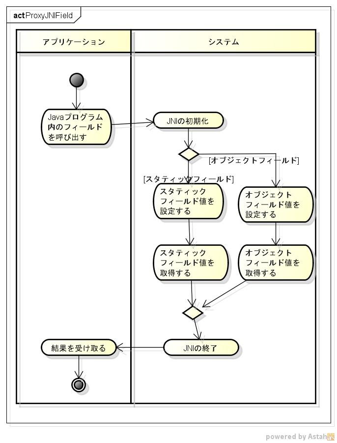
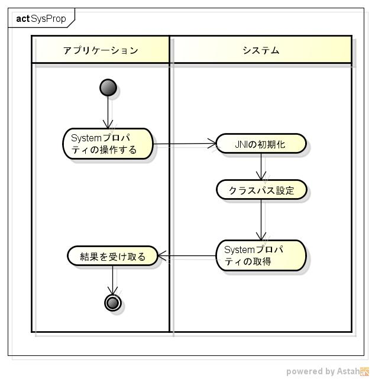

libproxyjniの機能仕様書
=======================
1. 目的

  

1. 前提

サポートOS: linux x86_64  
サポート動的プログラム: java 11以降  

1. 機能範囲

javaクラス内のスタティック・メゾッドを、呼び出す事ができる。  
javaクラス内のクラスのインスタンスを、生成することができる。  
javaクラス内のオブジェクト・メゾッドを、呼び出す事ができる。  
javaクラス内のフィールドに値を、設定する事ができる。  
javaクラス内のフィールドの値を、取得する事ができる。  

1. 機能範囲外

1. 制限事項

1. 詳細機能

  
  
  

