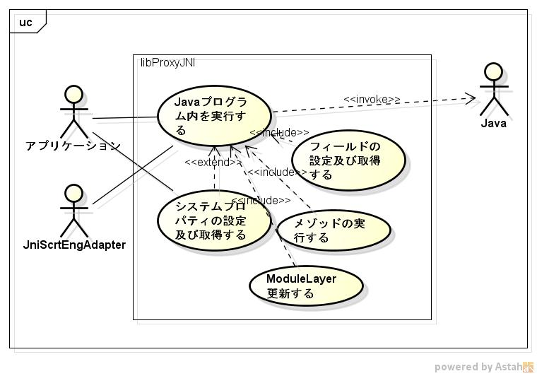

libproxyjniの機能仕様書
=======================
1. 目的

   c言語からjavaクラス内のメゾッドを、呼び出すことができる

1. 前提

    サポートOS      : linux x86_64  
    必要なライブラリ: java 11以降  

1. 機能範囲

      

1. 機能範囲外

1. 制限事項

    同じメゾットが複数ある場合は、先頭のみ呼び出せる

1. 詳細機能
    1. javaクラス内のStatic Methodを実行
    1. javaクラス内のClassインスタンスを生成
    1. javaクラス内のObject Methodを実行
    1. javaクラス内のField変数の設定
    1. javaクラス内のField変数の取得
    1. クラスパスの設定
    1. Systemプロパティの設定
    1. Systemプロパティの取得    

